# 📎 Anexos Técnicos - TeAlquilamos Bot

## Anexo A: Lista Completa de Funciones

### Funciones Principales del Sistema

| Función | Ubicación | Estado | Propósito |
|---------|-----------|--------|-----------|
| `main()` | L274 | ✅ Activa | Inicialización principal |
| `processWebhook()` | L2695 | ✅ Activa | Procesar webhooks entrantes |
| `processGlobalBuffer()` | L628 | ✅ Activa | Procesar buffer de mensajes |
| `processWithOpenAI()` | L1150-2478 | ⚠️ Refactorizar | Procesamiento con IA |
| `transcribeAudio()` | L175 | ✅ Activa | Transcribir audio a texto |
| `acquireThreadLock()` | L256 | ✅ Activa | Adquirir lock de thread |
| `releaseThreadLock()` | L260 | ✅ Activa | Liberar lock de thread |
| `setupEndpoints()` | L404 | ✅ Activa | Configurar endpoints API |
| `setupSignalHandlers()` | L564 | ✅ Activa | Manejar señales del sistema |
| `getShortUserId()` | L601 | ✅ Activa | Obtener ID corto de usuario |
| `cleanContactName()` | L610 | ✅ Activa | Limpiar nombre de contacto |
| `updateTypingStatus()` | L679 | ✅ Activa | Actualizar estado de typing |
| `addToGlobalBuffer()` | L705 | ✅ Activa | Agregar mensaje al buffer |
| `sendWhatsAppMessage()` | L756 | ✅ Activa | Enviar mensaje WhatsApp |
| `cleanupOldRuns()` | L1050 | ✅ Activa | Limpiar runs antiguos |
| `isRunActive()` | L1111 | ✅ Activa | Verificar si run está activo |
| `setupWebhooks()` | L1150 | ✅ Activa | Configurar webhooks |
| `initializeBot()` | L2478 | ✅ Activa | Inicializar bot |
| `recoverOrphanedRuns()` | L2634 | ✅ Activa | Recuperar runs huérfanos |

### Funciones de Logging (Activas)

| Función | Categoría | Uso |
|---------|-----------|-----|
| `logInfo()` | INFO | General information |
| `logSuccess()` | SUCCESS | Successful operations |
| `logError()` | ERROR | Error handling |
| `logWarning()` | WARNING | Warnings |
| `logDebug()` | DEBUG | Debug information |
| `logFatal()` | FATAL | Fatal errors |
| `logAlert()` | ALERT | Important alerts |
| `logMessageReceived()` | MESSAGE | Incoming messages |
| `logOpenAIRequest()` | OPENAI | API requests |
| `logOpenAIResponse()` | OPENAI | API responses |
| `logFunctionCallingStart()` | FUNCTION | Function calling |
| `logThreadCreated()` | THREAD | Thread management |

### Funciones Obsoletas (Comentadas)

| Función | Razón | Línea |
|---------|-------|-------|
| `logTrace()` | No utilizada | L35 |
| `logMessageProcess()` | Redundante | L37 |
| `logWhatsAppSend()` | Reemplazada | L38 |
| `logBeds24Request()` | No implementada | L45 |
| `logThreadPersist()` | Simplificada | L50 |
| `logBotReady()` | No necesaria | L53 |
| `updateActiveThreads()` | Obsoleta | L87 |

---

## Anexo B: Diagramas de Flujo Detallados

### B.1 Flujo Completo de Procesamiento de Mensaje

```mermaid
sequenceDiagram
    participant U as Usuario
    participant W as WHAPI
    participant H as Webhook Handler
    participant B as Buffer System
    participant L as Lock Manager
    participant P as Processor
    participant O as OpenAI
    participant F as Function Handler
    participant D as Data Store

    U->>W: Envía mensaje
    W->>H: POST /hook
    H->>H: Validar webhook
    
    alt Es audio
        H->>O: Transcribir audio
        O-->>H: Texto transcrito
    end
    
    H->>B: addToGlobalBuffer()
    B->>B: Iniciar timer 5s
    
    Note over B: Espera 5 segundos<br/>para más mensajes
    
    B->>L: acquireThreadLock()
    L-->>B: Lock adquirido
    
    B->>P: processWithOpenAI()
    P->>D: Obtener/Crear thread
    P->>O: Crear mensaje en thread
    P->>O: Crear run
    
    loop Polling
        P->>O: Verificar estado del run
        alt Requiere acción
            P->>F: Ejecutar función
            F-->>P: Resultado
            P->>O: Enviar resultado
        end
    end
    
    P->>W: Enviar respuesta
    W->>U: Mensaje del bot
    
    P->>L: releaseThreadLock()
    P->>D: Actualizar estado
```



### B.2 Sistema de Buffering

```mermaid
stateDiagram-v2
    [*] --> Idle
    
    Idle --> Receiving : Mensaje recibido
    
    Receiving --> Buffering : Agregar al buffer
    
    Buffering --> Waiting : Iniciar timer 5s
    
    Waiting --> Buffering : Más mensajes
    Waiting --> Processing : Timer expirado
    
    Processing --> Locked : Adquirir lock
    
    Locked --> OpenAI : Procesar con IA
    
    OpenAI --> Response : Generar respuesta
    
    Response --> Cleanup : Enviar mensaje
    
    Cleanup --> [*] : Liberar recursos
```



---

## Anexo C: Scripts de Limpieza Sugeridos

### C.1 Script para Eliminar Código Muerto

```bash
#!/bin/bash
# cleanup-dead-code.sh

echo "🧹 Limpiando código muerto..."

# Eliminar imports comentados
sed -i '/^[[:space:]]*\/\/ import.*\/\/ ❌ No se usa/d' src/app-unified.ts

# Eliminar variables comentadas obsoletas
sed -i '/^[[:space:]]*\/\/ const.*\/\/ ❌ No se usa/d' src/app-unified.ts

# Eliminar secciones ELIMINADO
sed -i '/^[[:space:]]*\/\/ 🔧 ELIMINADO/,/^[[:space:]]*$/d' src/app-unified.ts

echo "✅ Código muerto eliminado"
```

### C.2 Script para Implementar Límites de Memoria

```typescript
// memory-limits.ts
// Agregar a src/utils/memory-limits.ts

export class MemoryLimitedSet<T> {
  private items: Set<T>;
  private maxSize: number;
  
  constructor(maxSize: number = 1000) {
    this.items = new Set();
    this.maxSize = maxSize;
  }
  
  add(item: T): void {
    if (this.items.size >= this.maxSize) {
      const firstItem = this.items.values().next().value;
      this.items.delete(firstItem);
    }
    this.items.add(item);
  }
  
  has(item: T): boolean {
    return this.items.has(item);
  }
  
  get size(): number {
    return this.items.size;
  }
}

// Uso:
// const botSentMessages = new MemoryLimitedSet<string>(1000);
```

### C.3 Script de Análisis de Complejidad

```javascript
// analyze-complexity.js
const fs = require('fs');
const path = require('path');

function analyzeComplexity(filePath) {
  const content = fs.readFileSync(filePath, 'utf8');
  const lines = content.split('\n');
  
  let currentFunction = null;
  let functionComplexity = {};
  let branchCount = 0;
  
  lines.forEach((line, index) => {
    // Detectar inicio de función
    if (line.match(/^(async\s+)?function\s+(\w+)|^const\s+(\w+)\s*=\s*(async\s*)?\(/)) {
      if (currentFunction) {
        functionComplexity[currentFunction] = {
          lines: index - functionComplexity[currentFunction].start,
          complexity: branchCount
        };
      }
      currentFunction = line.match(/function\s+(\w+)|const\s+(\w+)/)[1] || line.match(/function\s+(\w+)|const\s+(\w+)/)[2];
      functionComplexity[currentFunction] = { start: index };
      branchCount = 1;
    }
    
    // Contar branches
    if (line.match(/if\s*\(|else\s+if|else\s*{|switch\s*\(|case\s+|while\s*\(|for\s*\(/)) {
      branchCount++;
    }
  });
  
  // Ordenar por complejidad
  const sorted = Object.entries(functionComplexity)
    .filter(([_, data]) => data.complexity)
    .sort((a, b) => b[1].complexity - a[1].complexity)
    .slice(0, 10);
  
  console.log('Top 10 funciones más complejas:');
  sorted.forEach(([name, data]) => {
    console.log(`${name}: Complejidad ${data.complexity}, ${data.lines} líneas`);
  });
}

analyzeComplexity('src/app-unified.ts');
```

---

## Anexo D: Configuración de Monitoreo Sugerida

### D.1 Métricas Prometheus

```yaml
# prometheus-metrics.yaml
metrics:
  - name: bot_messages_processed_total
    type: counter
    help: Total number of messages processed
    labels: [status, type]
    
  - name: bot_processing_duration_seconds
    type: histogram
    help: Message processing duration
    buckets: [0.1, 0.5, 1, 2, 5, 10, 30]
    
  - name: bot_openai_tokens_used_total
    type: counter
    help: Total OpenAI tokens consumed
    labels: [model, operation]
    
  - name: bot_active_threads_gauge
    type: gauge
    help: Number of active conversation threads
    
  - name: bot_memory_usage_bytes
    type: gauge
    help: Memory usage in bytes
    labels: [type]
```

### D.2 Dashboard Grafana

```json
{
  "dashboard": {
    "title": "TeAlquilamos Bot Monitoring",
    "panels": [
      {
        "title": "Messages per Minute",
        "targets": [{
          "expr": "rate(bot_messages_processed_total[1m])"
        }]
      },
      {
        "title": "Processing Latency",
        "targets": [{
          "expr": "histogram_quantile(0.95, bot_processing_duration_seconds)"
        }]
      },
      {
        "title": "OpenAI Token Usage",
        "targets": [{
          "expr": "rate(bot_openai_tokens_used_total[5m])"
        }]
      },
      {
        "title": "Memory Usage",
        "targets": [{
          "expr": "bot_memory_usage_bytes"
        }]
      }
    ]
  }
}
```

---

## Anexo E: Plantilla de Refactorización

### E.1 Ejemplo de Refactorización de processWithOpenAI

```typescript
// Antes: Una función de 1300+ líneas
async function processWithOpenAI(...) {
  // 1300 líneas de código...
}

// Después: Funciones modulares
class OpenAIProcessor {
  async process(userId: string, messages: string[], context: Context) {
    const thread = await this.threadManager.getOrCreate(userId);
    const enrichedMessages = await this.messageEnricher.enrich(messages, context);
    const run = await this.runManager.create(thread, enrichedMessages);
    const result = await this.runExecutor.execute(run);
    return this.responseFormatter.format(result);
  }
}

class ThreadManager {
  async getOrCreate(userId: string): Promise<Thread> {
    // Lógica específica de threads
  }
}

class MessageEnricher {
  async enrich(messages: string[], context: Context): Promise<Message[]> {
    // Lógica de enriquecimiento
  }
}

class RunManager {
  async create(thread: Thread, messages: Message[]): Promise<Run> {
    // Lógica de creación de runs
  }
}

class RunExecutor {
  async execute(run: Run): Promise<Result> {
    // Lógica de ejecución y polling
  }
}

class ResponseFormatter {
  format(result: Result): string {
    // Lógica de formateo
  }
}
```

---

## Anexo F: Checklist de Implementación

### F.1 Fase 1 - Limpieza (1 semana)

- [ ] Ejecutar script de eliminación de código muerto
- [ ] Implementar MemoryLimitedSet para botSentMessages
- [ ] Agregar límites a todos los Maps y Sets globales
- [ ] Eliminar imports comentados
- [ ] Documentar funciones principales con JSDoc
- [ ] Crear tests básicos para funciones críticas

### F.2 Fase 2 - Optimización (2-3 semanas)

- [ ] Dividir processWithOpenAI en módulos
- [ ] Implementar cache para Beds24 API
- [ ] Agregar circuit breaker para APIs externas
- [ ] Optimizar transcripción con cache
- [ ] Implementar streaming para archivos grandes
- [ ] Mejorar manejo de errores con clases específicas

### F.3 Fase 3 - Arquitectura (1 mes)

- [ ] Migrar a estructura modular completa
- [ ] Implementar inyección de dependencias
- [ ] Agregar validación de esquemas con Joi/Zod
- [ ] Crear suite completa de tests
- [ ] Implementar rate limiting robusto
- [ ] Documentar arquitectura completa

### F.4 Fase 4 - Escalabilidad (2-3 meses)

- [ ] Implementar worker threads
- [ ] Agregar Redis para cache distribuido
- [ ] Implementar message queue
- [ ] Preparar para multi-tenant
- [ ] Implementar sharding de datos
- [ ] Optimizar para alta concurrencia

---

**Documento de Anexos generado:** 2025-07-23
**Versión:** 1.0