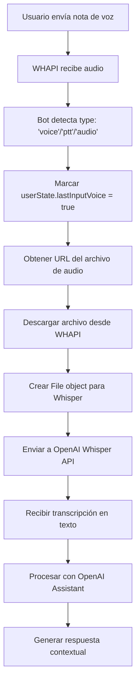

# 🎤➡️📝 Sistema Audio-to-Text (Transcripción)

## 📋 Descripción General

El sistema de **Audio-to-Text** permite al bot transcribir notas de voz y archivos de audio que los usuarios envían por WhatsApp, convirtiéndolos en texto para que el Assistant pueda procesarlos y responder adecuadamente.

## 🔧 Componentes Técnicos

### 1. **Detección de Audio**
```typescript
// En app-unified.ts línea ~3333
if (message.type === 'voice' || message.type === 'audio' || message.type === 'ptt') {
    // Marcar que el usuario envió voz
    userState.lastInputVoice = true;
    
    // Procesar transcripción
    const transcription = await transcribeAudio(audioUrl, userId, userName, message.id);
}
```

### 2. **Función de Transcripción**
```typescript
// Función transcribeAudio (línea ~333)
async function transcribeAudio(audioUrl: string, userId: string, userName?: string, messageId?: string): Promise<string> {
    // 1. Descargar archivo de audio desde WHAPI
    const audioResponse = await fetch(finalAudioUrl);
    const audioBuffer = await audioResponse.arrayBuffer();
    
    // 2. Crear objeto File para Whisper
    const audioFile = new File([new Uint8Array(audioBuffer)], 'audio.ogg', { type: 'audio/ogg' });
    
    // 3. Transcribir con OpenAI Whisper
    const transcription = await openai.audio.transcriptions.create({
        file: audioFile,
        model: 'whisper-1',
        language: 'es',
        response_format: 'json'
    });
    
    return transcription.text;
}
```

## 🎯 Flujo Completo



## ⚙️ Configuración

### Variables de Entorno
```bash
# Habilitar transcripción de voz
ENABLE_VOICE_TRANSCRIPTION=true

# Idioma para Whisper (español)
WHISPER_LANGUAGE=es

# Límites de archivo
MAX_AUDIO_SIZE=26214400      # 25MB
MAX_AUDIO_DURATION=300       # 5 minutos
```

### Formatos Soportados
- **WhatsApp nativo**: `.ogg` (Opus codec)
- **Archivos de audio**: `.mp3`, `.m4a`, `.wav`, `.webm`, `.flac`
- **Límites**: 25MB máximo, 5 minutos duración

## 🔍 Características Especiales

### 1. **Formato Contextual**
El texto transcrito se envía al Assistant con contexto:
```typescript
const formattedMessage = `🎤 [NOTA DE VOZ]: ${transcribedText}`;
```

### 2. **Manejo de Errores**
```typescript
try {
    const transcription = await transcribeAudio(audioUrl, userId, userName, message.id);
    // Procesamiento exitoso
} catch (error) {
    // Fallback: informar error sin detener el bot
    logError('VOICE_TRANSCRIPTION_ERROR', 'Error transcribiendo audio', {
        userId: getShortUserId(userId),
        error: error.message
    });
    
    // Respuesta de error amigable
    await sendWhatsAppMessage(userId, "Lo siento, no pude procesar tu nota de voz. ¿Podrías escribir tu mensaje?");
}
```

### 3. **Optimizaciones**
- **Detección automática de formato** desde URL y headers
- **Logs técnicos** para debugging y monitoreo
- **Timeout configurable** para evitar cuelgues
- **Retry logic** para fallos temporales

## 📊 Logs y Monitoreo

### Eventos Registrados
```typescript
// Inicio de transcripción
logInfo('VOICE_TRANSCRIPTION_START', 'Iniciando transcripción de audio', {
    userId: shortUserId,
    audioUrl: finalAudioUrl
});

// Transcripción exitosa
logSuccess('VOICE_TRANSCRIPTION_SUCCESS', 'Audio transcrito exitosamente', {
    userId: shortUserId,
    transcriptionLength: transcribedText.length,
    audioSize: audioBuffer.length
});

// Error en transcripción
logError('VOICE_TRANSCRIPTION_ERROR', 'Error transcribiendo audio', {
    userId: shortUserId,
    error: error.message
});
```

## 🧪 Testing

### Tests Disponibles
1. **`test-real-audio-flow.js`**: Flujo completo de transcripción
2. **`test-voice-response-ready.js`**: Verificación de configuración
3. **`test-audio-formats.js`**: Prueba de múltiples formatos

### Ejecutar Tests
```bash
# Test completo de transcripción
node tests/audio/test-real-audio-flow.js

# Verificar configuración
node tests/audio/test-voice-response-ready.js
```

## 🚨 Troubleshooting

### Problemas Comunes

#### 1. "Invalid file format"
```bash
# Causa: Formato de audio no soportado
# Solución: Verificar que sea .ogg, .mp3, .m4a, .wav, .webm, o .flac
```

#### 2. "File too large"
```bash
# Causa: Archivo mayor a 25MB
# Solución: Ajustar MAX_AUDIO_SIZE o comprimir audio
```

#### 3. "Transcription timeout"
```bash
# Causa: Audio muy largo o conexión lenta
# Solución: Aumentar OPENAI_TIMEOUT o verificar conexión
```

### Debug Mode
```bash
# Habilitar logs detallados
DEBUG_MODE=true
LOG_LEVEL=development
ENABLE_DETAILED_LOGS=true
```

## 📈 Métricas de Rendimiento

### Tiempos Esperados
- **Audio 30s**: ~2-4 segundos transcripción
- **Audio 2min**: ~5-8 segundos transcripción  
- **Audio 5min**: ~10-15 segundos transcripción

### Recursos
- **CPU**: Mínimo durante transcripción (procesamiento en OpenAI)
- **Memoria**: ~10-20MB por archivo temporal
- **Red**: Dependiente del tamaño del archivo

## 🔄 Integración con Respuestas de Voz

Cuando un usuario envía voz, el sistema:
1. **Transcribe el audio** (este módulo)
2. **Marca `lastInputVoice = true`**
3. **Procesa con Assistant**
4. **Responde con audio** (módulo Text-to-Audio)

Esta integración completa el ciclo **voz → voz** para una experiencia natural.

---

**📝 Nota**: Este sistema utiliza la API de Whisper de OpenAI, que es altamente precisa para español y maneja automáticamente ruido de fondo, diferentes acentos y velocidades de habla.