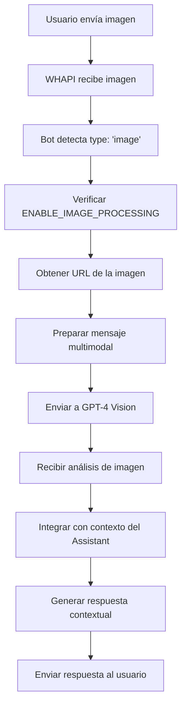

# 🖼️➡️📝 Sistema de Procesamiento de Imágenes

## 📋 Descripción General

El sistema de **procesamiento de imágenes** permite al bot analizar imágenes enviadas por los usuarios a través de WhatsApp, utilizando las capacidades de visión de los modelos de OpenAI (GPT-4 Vision) para generar descripciones, responder preguntas sobre el contenido y proporcionar asistencia contextual.

## 🔧 Componentes Técnicos

### 1. **Detección de Imágenes**
```typescript
// En app-unified.ts, procesamiento de webhooks
if (message.type === 'image') {
    // Verificar si el procesamiento de imágenes está habilitado
    if (process.env.ENABLE_IMAGE_PROCESSING === 'true') {
        const imageUrl = message.image?.link;
        if (imageUrl) {
            // Procesar imagen con GPT-4 Vision
            await processImageMessage(userId, imageUrl, message.image?.caption);
        }
    }
}
```

### 2. **Función de Procesamiento de Imágenes**
```typescript
async function processImageMessage(userId: string, imageUrl: string, caption?: string) {
    try {
        // Preparar mensaje con imagen para GPT-4 Vision
        const imageMessage = {
            role: 'user',
            content: [
                {
                    type: 'text',
                    text: caption || 'Analiza esta imagen y proporciona una descripción detallada'
                },
                {
                    type: 'image_url',
                    image_url: {
                        url: imageUrl,
                        detail: 'high' // Para análisis detallado
                    }
                }
            ]
        };

        // Enviar a OpenAI con modelo de visión
        const response = await openaiClient.chat.completions.create({
            model: process.env.IMAGE_ANALYSIS_MODEL || 'gpt-4o-mini',
            messages: [imageMessage],
            max_tokens: 1000
        });

        return response.choices[0].message.content;
    } catch (error) {
        logError('IMAGE_PROCESSING_ERROR', 'Error procesando imagen', {
            userId: getShortUserId(userId),
            error: error.message
        });
        throw error;
    }
}
```

### 3. **Integración con Assistant**
```typescript
// La descripción de la imagen se integra con el contexto del Assistant
const imageAnalysis = await processImageMessage(userId, imageUrl, caption);
const contextualMessage = `El usuario envió una imagen: ${imageAnalysis}. ${caption || ''}`;

// Se envía al Assistant para respuesta contextual
await processWithAssistant(userId, contextualMessage);
```

## 🎯 Flujo Completo



## ⚙️ Configuración

### Variables de Entorno
```bash
# Habilitar procesamiento de imágenes
ENABLE_IMAGE_PROCESSING=true

# Modelo para análisis de imágenes
IMAGE_ANALYSIS_MODEL=gpt-4o-mini       # Recomendado: costo-efectivo
# Opciones: gpt-4o, gpt-4o-mini, gpt-4-turbo

# Límites de archivo
MAX_IMAGE_SIZE=20971520                # 20MB máximo
```

### Modelos Disponibles

| Modelo | Capacidades | Costo | Uso Recomendado |
|--------|-------------|-------|------------------|
| **gpt-4o-mini** | Buena visión, rápido | Bajo | ✅ **Recomendado** - Uso general |
| **gpt-4o** | Excelente visión | Alto | Análisis complejos |
| **gpt-4-turbo** | Muy buena visión | Medio | Balance calidad/costo |

## 🔍 Características Especiales

### 1. **Análisis Contextual**
```typescript
// El bot puede responder preguntas específicas sobre imágenes
const contextPrompts = {
    property: "Analiza esta imagen de propiedad inmobiliaria y describe sus características",
    menu: "Lee este menú y ayúdame a elegir opciones",
    document: "Extrae la información importante de este documento",
    general: "Describe qué ves en esta imagen y cómo puedo ayudarte"
};
```

### 2. **Integración con RAG**
```typescript
// La información de la imagen se combina con el conocimiento del Assistant
const enrichedContext = {
    imageAnalysis: analysisResult,
    userQuery: caption,
    businessContext: "hotel and accommodation services",
    availableServices: hotelServices
};
```

### 3. **Formatos Soportados**
- **JPEG/JPG**: Formato universal
- **PNG**: Con transparencia
- **GIF**: Estático (no animado)
- **WebP**: Formato moderno
- **BMP**: Formato básico

## 📊 Logs y Monitoreo

### Eventos Registrados
```typescript
// Inicio de procesamiento
logInfo('IMAGE_PROCESSING_START', 'Iniciando análisis de imagen', {
    userId: shortUserId,
    imageUrl: imageUrl,
    caption: caption || 'sin caption'
});

// Análisis exitoso
logSuccess('IMAGE_ANALYSIS_SUCCESS', 'Imagen analizada exitosamente', {
    userId: shortUserId,
    analysisLength: analysisResult.length,
    model: process.env.IMAGE_ANALYSIS_MODEL
});

// Error en procesamiento
logError('IMAGE_PROCESSING_ERROR', 'Error procesando imagen', {
    userId: shortUserId,
    error: error.message,
    imageUrl: imageUrl
});
```

## 🧪 Testing

### Tests Disponibles
1. **`test-full-image-flow.js`**: Flujo completo de procesamiento
2. **`test-image-multimodal.js`**: Test de capacidades multimodales
3. **`test-real-assistant-image.js`**: Integración con Assistant
4. **`test-direct-vision.js`**: Test directo de GPT-4 Vision
5. **`test-url-image.js`**: Test con URLs de imágenes

### Ejecutar Tests
```bash
# Test completo de procesamiento
node tests/media/test-full-image-flow.js

# Test multimodal
node tests/media/test-image-multimodal.js

# Test con Assistant real
node tests/media/test-real-assistant-image.js
```

## 🚨 Troubleshooting

### Problemas Comunes

#### 1. "Image too large"
```bash
# Causa: Imagen mayor a 20MB
# Solución: Comprimir imagen o ajustar MAX_IMAGE_SIZE
```

#### 2. "Unsupported format"
```bash
# Causa: Formato no soportado (ej: TIFF, RAW)
# Solución: Convertir a JPEG, PNG, o WebP
```

#### 3. "Vision model error"
```bash
# Causa: Modelo no disponible o límites de rate
# Solución: Verificar modelo y límites de API
```

#### 4. "URL not accessible"
```bash
# Causa: URL de imagen no accesible desde OpenAI
# Solución: Verificar que la URL sea pública y accesible
```

### Debug Mode
```bash
# Habilitar logs detallados
DEBUG_MODE=true
LOG_LEVEL=development
ENABLE_DETAILED_LOGS=true

# Test específico
node tests/media/test-direct-vision.js
```

## 📈 Métricas de Rendimiento

### Tiempos de Procesamiento
- **Imagen simple**: ~3-5 segundos
- **Imagen compleja**: ~5-8 segundos
- **Documento/texto**: ~4-7 segundos

### Consumo de Tokens
- **gpt-4o-mini**: ~100-300 tokens por imagen
- **gpt-4o**: ~200-500 tokens por imagen
- **Consideración**: Las imágenes consumen tokens de entrada

### Recursos
- **CPU**: Mínimo (procesamiento en OpenAI)
- **Memoria**: ~5-20MB por imagen temporal
- **Red**: Tamaño de imagen + overhead API

## 🎯 Casos de Uso Específicos

### 1. **Hotelería y Hospitalidad**
```typescript
const hotelPrompts = {
    room_photo: "Analiza esta foto de habitación y describe sus amenidades y características",
    facility_image: "Describe las instalaciones que se ven en esta imagen del hotel",
    menu_analysis: "Lee este menú y explica las opciones disponibles",
    reservation_document: "Extrae la información relevante de este documento de reserva"
};
```

### 2. **Documentos y Texto**
```typescript
const documentPrompts = {
    invoice: "Extrae los datos importantes de esta factura",
    contract: "Resume los puntos clave de este contrato",
    id_card: "Lee la información de este documento de identidad",
    receipt: "Confirma los detalles de este recibo"
};
```

### 3. **Consultas Visuales**
```typescript
const visualPrompts = {
    comparison: "Compara las opciones que se muestran en esta imagen",
    instruction: "Explica cómo seguir las instrucciones mostradas",
    problem: "Analiza el problema que se muestra en la imagen",
    location: "Describe la ubicación que se ve en la imagen"
};
```

## 🔄 Integración con Sistema Completo

### Flujo Multimodal
```typescript
// 1. Usuario envía imagen con texto
const multimodalInput = {
    image: imageUrl,
    text: caption,
    context: conversationHistory
};

// 2. Análisis de imagen
const imageAnalysis = await processImageMessage(userId, imageUrl, caption);

// 3. Combinación contextual
const enrichedMessage = `Imagen: ${imageAnalysis}. Consulta: ${caption}`;

// 4. Procesamiento con Assistant
const response = await processWithAssistant(userId, enrichedMessage);
```

### Estados del Usuario
```typescript
interface UserState {
    lastImageSent?: string;      // URL de última imagen
    imageContext?: string;       // Contexto de imagen anterior
    pendingImageQuery?: string;  // Consulta pendiente sobre imagen
}
```

## 🛡️ Seguridad y Privacidad

### 1. **Manejo de URLs**
- **Validación**: URLs deben ser accesibles públicamente
- **HTTPS**: Solo URLs seguras son procesadas
- **Timeouts**: Prevención de cuelgues por URLs lentas

### 2. **Contenido Sensible**
- **Filtros**: OpenAI aplica filtros de contenido automáticamente
- **Logs**: No se almacenan URLs de imágenes permanentemente
- **Privacidad**: Imágenes no se guardan localmente

### 3. **Límites y Controles**
```typescript
const securityLimits = {
    maxImageSize: 20 * 1024 * 1024,  // 20MB
    maxImagesPerMinute: 10,           // Rate limiting
    allowedDomains: ['whapi.cloud'],  // URLs confiables
    contentFilters: true              // Filtros de contenido
};
```

---

**📸 Nota**: El sistema de procesamiento de imágenes está optimizado para casos de uso de hospitalidad y servicio al cliente, proporcionando análisis contextual que mejora significativamente la capacidad del bot para asistir a los usuarios con contenido visual.