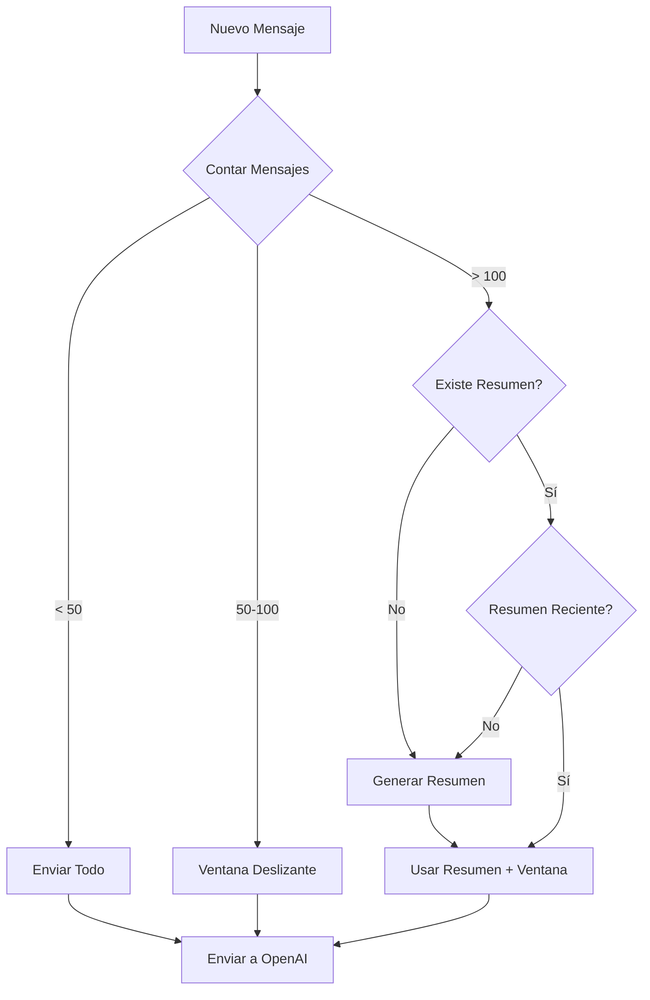

# Estrategia para Manejar 200+ Mensajes de Contexto

## El Problema

- Necesitamos mantener contexto de hasta 200 mensajes
- Con `previous_response_id` simple, esto significa:
  - 8,000-10,000 tokens por request
  - $0.001-0.002 por mensaje
  - Sin control sobre qué información mantener

## Solución Propuesta: Sistema Híbrido

### Arquitectura de 3 Capas

```
┌─────────────────────────────────────────┐
│         CAPA 1: CACHE INMEDIATO         │
│     (Últimos 20-30 mensajes en RAM)     │
└─────────────────────────────────────────┘
                    ↓
┌─────────────────────────────────────────┐
│      CAPA 2: CONTEXTO DESLIZANTE        │
│    (50-100 mensajes más relevantes)     │
└─────────────────────────────────────────┘
                    ↓
┌─────────────────────────────────────────┐
│      CAPA 3: RESUMEN INTELIGENTE        │
│   (Condensación de msgs anteriores)     │
└─────────────────────────────────────────┘
```

### Estrategias por Longitud de Conversación

| Mensajes | Estrategia | Tokens Aprox | Costo/msg |
|----------|------------|--------------|-----------|
| 0-50     | Todo el contexto | 2,000 | $0.0003 |
| 51-100   | Ventana deslizante | 4,000 | $0.0006 |
| 101-150  | Resumen + ventana | 3,000 | $0.0005 |
| 151-200+ | Resumen detallado + ventana | 4,000 | $0.0006 |

### Implementación Técnica

#### 1. Migrar a Conversations API

```typescript
// Crear conversación persistente
const conversation = await openai.conversations.create({
  metadata: {
    userId,
    chatId,
    strategy: 'long_context'
  }
});

// Usar en cada request
const response = await openai.responses.create({
  conversation: conversation.id,
  input: optimizedMessages,
  store: true
});
```

#### 2. Algoritmo de Selección de Mensajes

```typescript
function selectRelevantMessages(allMessages: Message[]): Message[] {
  // Siempre incluir
  const mustInclude = [
    ...firstNMessages(5),           // Contexto inicial
    ...lastNMessages(20),          // Conversación reciente
    ...messagesWithKeywords(),     // Reservas, precios, etc
    ...unansweredQuestions(),      // Preguntas pendientes
    ...confirmations()             // Decisiones tomadas
  ];
  
  // Llenar el resto con mensajes relevantes
  const remaining = selectByRelevanceScore(
    allMessages.filter(m => !mustInclude.includes(m)),
    maxTokens - tokenCount(mustInclude)
  );
  
  return [...mustInclude, ...remaining].sort(byTimestamp);
}
```

#### 3. Generación de Resúmenes

```typescript
async function generateSummary(messages: Message[]): Promise<string> {
  // Opción A: Usar el mismo modelo para resumir
  const summary = await openai.responses.create({
    model: 'gpt-4o-mini',
    input: [{
      role: 'system',
      content: 'Resume esta conversación manteniendo: decisiones, datos importantes, contexto del usuario'
    }, ...messages],
    max_tokens: 500
  });
  
  // Opción B: Extracción manual de información clave
  return extractKeyInfo(messages);
}
```

### Flujo de Decisión



### Campos Necesarios en BD

```sql
ALTER TABLE "Chats" ADD COLUMN "conversation_id" TEXT;
ALTER TABLE "Chats" ADD COLUMN "conversation_summary" TEXT;
ALTER TABLE "Chats" ADD COLUMN "summary_updated_at" TIMESTAMP;
ALTER TABLE "Chats" ADD COLUMN "total_message_count" INTEGER DEFAULT 0;
ALTER TABLE "Chats" ADD COLUMN "optimization_strategy" TEXT;
```

### Métricas Clave a Monitorear

1. **Eficiencia de Contexto**
   - Ratio: tokens enviados / mensajes totales
   - Meta: < 50 tokens por mensaje histórico

2. **Calidad de Respuesta**
   - ¿El bot recuerda información importante?
   - ¿Responde coherentemente con contexto antiguo?

3. **Costos**
   - Costo promedio por conversación
   - Costo por mensaje con contexto largo
   - ROI de la optimización

### Configuración Recomendada

```env
# Estrategia de Contexto
CONTEXT_STRATEGY=hybrid
CONTEXT_WINDOW_SIZE=50
ALWAYS_KEEP_LAST_MESSAGES=20
MAX_CONTEXT_TOKENS=10000
SUMMARY_TRIGGER_MESSAGES=100
SUMMARY_UPDATE_FREQUENCY_HOURS=24

# Palabras clave importantes (específicas del negocio)
IMPORTANT_KEYWORDS=reserva,booking,precio,fecha,confirmar,pago
```

### Timeline de Implementación

**Semana 1**: 
- Mantener `previous_response_id` actual
- Agregar logging de métricas

**Semana 2**:
- Implementar ventana deslizante
- Testing con conversaciones largas

**Semana 3**:
- Agregar generación de resúmenes
- Migrar a Conversations API

**Semana 4**:
- Optimización basada en métricas
- Ajuste de parámetros

### Ejemplo de Costo Real

Para 1000 usuarios con conversaciones de 200 mensajes:
- Sin optimización: ~$2/día
- Con ventana deslizante: ~$0.80/día
- Con resumen + ventana: ~$0.60/día

**Ahorro mensual: ~$42 (70%)**