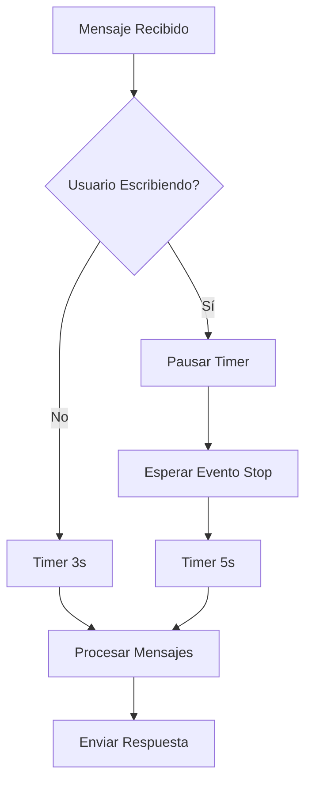

# Sistema de Buffer Basado en Typing

## 🎯 Descripción General

El sistema de buffer basado en typing reemplaza el buffer de tiempo fijo (4-8 segundos) por un sistema inteligente que detecta cuando el usuario está escribiendo y pausa las respuestas del bot hasta que termine, simulando un comportamiento humano natural.

## 🔧 Características Principales

### ✅ **Ventajas del Nuevo Sistema**

1. **Comportamiento Humano**
   - No interrumpe al usuario mientras escribe
   - Espera a que termine de escribir antes de responder
   - Agrupa todos los mensajes en una sola respuesta

2. **Eficiencia Operacional**
   - Menos llamadas a OpenAI (mensajes agrupados)
   - Respuestas más completas y contextuales
   - Reducción de respuestas fragmentadas

3. **Simplicidad**
   - Elimina timeouts arbitrarios
   - Lógica más predecible
   - Menos configuración manual

### ⚙️ **Configuración**

```typescript
// Constantes del sistema
const FALLBACK_TIMEOUT = 2000;        // 2s si no hay typing detectable
const POST_TYPING_DELAY = 3000;       // 3s después de que deje de escribir
const MAX_BUFFER_SIZE = 10;           // Límite anti-spam
```

## 🚀 **Implementación Técnica**

### **1. Eventos de Presencia (Webhook)**

El sistema recibe eventos de presencia de Whapi:

```json
{
  "presences": [
    {
      "contact_id": "573235906292",
      "status": "typing"
    }
  ],
  "event": {
    "type": "presences",
    "event": "post"
  }
}
```

**Estados de presencia:**
- `typing` / `recording` → Usuario está escribiendo
- `online` / `offline` / `pending` → Usuario dejó de escribir

### **2. Flujo de Procesamiento**



### **3. Estados del Usuario**

```typescript
interface UserTypingState {
    userId: string;
    isTyping: boolean;
    messages: string[];
    timer?: NodeJS.Timeout;
}
```

## 📋 **Configuración en Whapi**

### **Paso 1: Activar Eventos de Presencia**

1. Ve a **Settings → Webhooks** en el dashboard de Whapi
2. Marca la casilla para **presences: POST**
3. Asegúrate de que el modo sea **"body"**
4. Guarda la configuración

### **Paso 2: Configuración Automática**

```bash
# Configurar webhook automáticamente
node scripts/setup-typing-webhook.js
```

**⚠️ Importante: Dos APIs Diferentes**
- **PUT /presences/{EntryID}**: Para ENVIAR presencia desde tu bot
- **POST /presences/{EntryID}**: Para SUSCRIBIRSE a presencia del usuario
- **Webhook /hook**: Para RECIBIR eventos de presencia

### **Paso 3: Verificar Configuración**

```bash
# Probar eventos de presencia
node scripts/test-typing-events.js
```

## 🔍 **Logs y Monitoreo**

### **Eventos de Presencia**
```
✍️ 573235906292 está escribiendo... (pausando respuesta)
⏸️ 573235906292 dejó de escribir → ⏳ 5s...
```

### **Procesamiento de Mensajes**
```
👤 Usuario: "Hola, cómo estás?" → ⏳ 3s... (buffer: 1)
👤 Usuario: "Quiero consultar disponibilidad" → ✍️ esperando... (buffer: 2)
```

### **Logs Técnicos**
```
PRESENCE_RECEIVED: Presencia para 573235906292: typing
TIMER_PAUSED: Procesamiento pausado por typing en 573235906292
TIMER_STARTED_AFTER_TYPING: Typing stopped; timer 5s iniciado para 573235906292
```

## 🧪 **Pruebas y Validación**

### **🔍 Debugging con Ngrok Inspect**

**URL CRÍTICA para debugging:**
```bash
http://localhost:4040/inspect/http
```

**¿Por qué es esencial?**
- ✅ Ver eventos de mensajes en tiempo real
- ✅ Ver eventos de presencia (typing) antes de que lleguen al bot
- ✅ Debuggear problemas de webhook
- ✅ Verificar que Whapi envíe datos correctamente

**Cómo usar:**
1. Inicia tu bot: `npm run dev:local`
2. Abre en navegador: `http://localhost:4040/inspect/http`
3. Envía mensajes desde WhatsApp
4. Observa los requests en tiempo real

### **Escenarios de Prueba**

1. **Usuario Escribe Rápido**
   - Envía mensaje → Timer 2s → Procesa inmediatamente

2. **Usuario Escribe Largo**
   - Comienza a escribir → Pausa timer
   - Envía múltiples mensajes → Se agrupan
   - Deja de escribir → Timer 3s → Procesa todo junto

3. **Sin Eventos de Typing**
   - Fallback a timer de 2 segundos
   - Funciona igual que antes pero más rápido

### **Script de Pruebas**

```bash
# Probar con tu número de teléfono
node scripts/test-typing-events.js http://localhost:3000/hook 573235906292
```

## ⚠️ **Limitaciones y Consideraciones**

### **Privacidad del Usuario**
- Si el usuario oculta "visto por última vez", no se reciben eventos de typing
- El sistema usa fallback automático (3 segundos)

### **Primera Interacción**
- Los eventos de presencia solo funcionan después de la primera interacción
- El bot se suscribe automáticamente a la presencia del usuario

### **Rate Limits**
- Los eventos de presencia pueden ser frecuentes
- El sistema está optimizado para procesamiento ligero

## 🔄 **Migración desde Buffer Fijo**

### **Cambios Automáticos**
- ✅ Eliminación de `MESSAGE_BUFFER_TIMEOUT`
- ✅ Nuevo procesamiento de eventos de presencia
- ✅ Suscripción automática a presencia
- ✅ Limpieza de estados de typing

### **Compatibilidad**
- ✅ Mantiene toda la funcionalidad existente
- ✅ Fallback automático si no hay typing
- ✅ No requiere cambios en la configuración del usuario

## 📊 **Métricas y Monitoreo**

### **Nuevas Métricas**
- Eventos de presencia recibidos
- Timers pausados por typing
- Mensajes agrupados por typing
- Tiempo promedio de espera post-typing

### **Logs de Debug**
```bash
# Activar logs detallados
DETAILED_LOGS=true npm run dev
```

## 🛠️ **Troubleshooting**

### **Problema: No se reciben eventos de presencia**
**Solución:**
1. Verificar configuración en Whapi dashboard
2. Ejecutar `node scripts/setup-typing-webhook.js`
3. Verificar que el usuario no tenga privacidad activada

### **Problema: Respuestas muy lentas**
**Solución:**
1. Verificar logs de eventos de presencia
2. Ajustar `POST_TYPING_DELAY` si es necesario
3. Verificar que no haya bloqueos en el procesamiento

### **Problema: Mensajes no se agrupan**
**Solución:**
1. Verificar que `userTypingState` se esté actualizando
2. Revisar logs de `TIMER_PAUSED` y `TIMER_STARTED_AFTER_TYPING`
3. Verificar configuración de webhook

## 🎯 **Próximas Mejoras**

1. **Indicadores Visuales**
   - Mostrar "escribiendo..." cuando el bot espera
   - Indicadores de progreso en la UI

2. **Optimizaciones**
   - Ajuste dinámico de timeouts basado en comportamiento
   - Predicción de finalización de escritura

3. **Integración Avanzada**
   - Soporte para grupos
   - Integración con sistema de escalación manual

---

**Nota:** Este sistema mantiene la compatibilidad total con el sistema anterior mientras proporciona una experiencia mucho más natural y eficiente. 