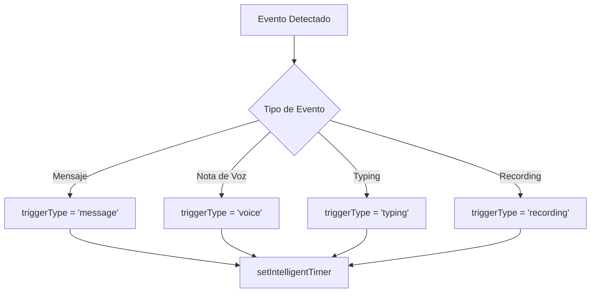
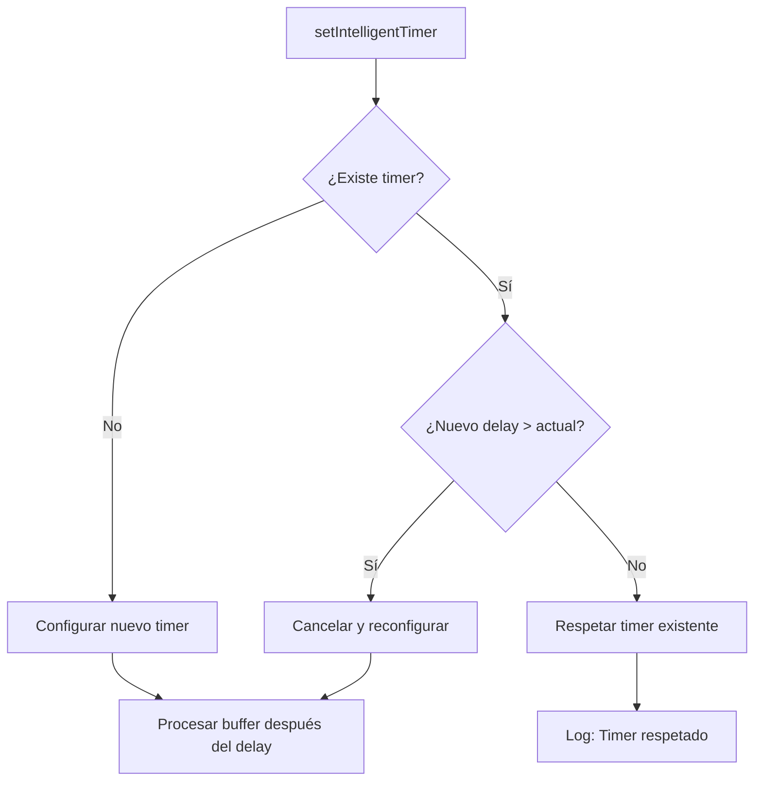

# 🔄 Sistema Unificado de Buffers y Timers

> **Fecha:** 2025-07-26  
> **Versión:** 2.0 - Sistema Unificado Inteligente  
> **Archivo:** `src/app-unified.ts` (líneas 938-1021)

## 📋 Resumen Ejecutivo

El **Sistema Unificado de Buffers y Timers** es una solución centralizada que maneja de forma inteligente el agrupamiento de mensajes, notas de voz, eventos de typing y recording para evitar conflictos entre diferentes sistemas de temporización.

### **Problema Resuelto:**
- ❌ **Antes:** Dos sistemas separados con conflictos de timers  
- ✅ **Después:** Un solo sistema con lógica de prioridad inteligente

---

## 🏗️ Arquitectura del Sistema

### **Función Central: `setIntelligentTimer()`**

```typescript
function setIntelligentTimer(
    userId: string, 
    chatId: string, 
    userName: string, 
    triggerType: 'message' | 'voice' | 'typing' | 'recording'
): void
```

**Ubicación:** `src/app-unified.ts:939-1021`

---

## ⏱️ Lógica de Prioridad de Timers

### **Jerarquía de Delays:**

| Trigger Type | Delay | Prioridad | Descripción |
|-------------|-------|-----------|-------------|
| `message` | 5s | Baja | Mensajes de texto normales |
| `voice` | 8s | Media | Notas de voz (puede escalar a 10s) |
| `voice` + grabando | 10s | Alta | Nota de voz mientras usuario graba |
| `typing` | 10s | Alta | Usuario escribiendo |
| `recording` | 10s | Alta | Usuario grabando |

### **Regla de Escalamiento:**
```typescript
// Solo reconfigurar si el nuevo delay es MAYOR
const shouldSetNewTimer = !buffer.timer || 
    (buffer.currentDelay && bufferDelay > buffer.currentDelay);
```

---

## 🔄 Flujo de Funcionamiento

### **1. Detección de Evento**


### **2. Evaluación de Prioridad**


---

## 📊 Ejemplos Prácticos

### **Caso 1: Escalamiento Progresivo**
```
1. Usuario envía texto → Timer 5s configurado
2. Usuario envía voz → Timer cancelado y reconfigurado a 8s
3. Usuario empieza a grabar → Timer cancelado y reconfigurado a 10s
4. Usuario deja de grabar → Mantiene 10s hasta procesar
```

### **Caso 2: Respeto de Prioridad**
```
1. Usuario está grabando → Timer 10s configurado
2. Usuario envía texto → Timer de 10s se respeta (5s < 10s)
3. Usuario envía voz → Timer de 10s se respeta (8s < 10s)
4. Buffer se procesa después de 10s con todos los mensajes
```

---

## 🔧 Componentes del Sistema

### **Buffer Global:**
```typescript
const globalMessageBuffers = new Map<string, {
    messages: string[],
    chatId: string,
    userName: string,
    lastActivity: number,
    timer: NodeJS.Timeout | null,
    currentDelay?: number  // NUEVO: Para comparaciones
}>();
```

### **Estados de Usuario:**
```typescript
interface UserState {
    // ... otros campos
    isCurrentlyRecording?: boolean;  // NUEVO: Para detectar grabación activa
    lastTyping?: number;             // Para tracking de actividad
}
```

---

## 📍 Puntos de Integración

### **1. Mensajes (addToGlobalBuffer)**
```typescript
// src/app-unified.ts:1061-1063
const triggerType = isVoice ? 'voice' : 'message';
setIntelligentTimer(userId, chatId, userName, triggerType);
```

### **2. Presencia (Webhook)**
```typescript
// src/app-unified.ts:3185-3186
setIntelligentTimer(userId, `${userId}@s.whatsapp.net`, 
    getShortUserId(userId), status as 'typing' | 'recording');
```

---

## 📝 Logs y Monitoreo

### **Eventos Loggeados:**

1. **`BUFFER_TIMER_SET`**: Timer configurado/reconfigurado
   ```json
   {
     "userJid": "573003913251",
     "timerMs": 10000,
     "triggerType": "recording",
     "wasReconfigured": true
   }
   ```

2. **`BUFFER_TIMER_CANCELLED`**: Timer cancelado por uno de mayor prioridad
   ```json
   {
     "userJid": "573003913251", 
     "oldDelay": 5000,
     "newDelay": 10000,
     "triggerType": "recording"
   }
   ```

3. **`BUFFER_TIMER_RESPECTED`**: Timer existente respetado
   ```json
   {
     "userJid": "573003913251",
     "currentDelay": 10000,
     "requestedDelay": 5000,
     "triggerType": "message"
   }
   ```

---

## 🚀 Beneficios del Sistema Unificado

### **1. Consistencia**
- ✅ Una sola función maneja todos los tipos de timer
- ✅ Lógica de prioridad consistente en todo el sistema
- ✅ No más conflictos entre sistemas separados

### **2. Escalabilidad**
- ✅ Fácil agregar nuevos tipos de trigger
- ✅ Modificar delays desde un solo lugar
- ✅ Lógica centralizada para optimizaciones futuras

### **3. Observabilidad**
- ✅ Logs detallados de todas las decisiones de timer
- ✅ Tracking de qué eventos causaron cada reconfiguración
- ✅ Métricas de eficiencia del sistema de agrupamiento

---

## 🔮 Futuras Optimizaciones

### **1. Timers Adaptativos**
```typescript
// Ejemplo: Ajustar delays según historial del usuario
const userBehavior = analyzeUserTypingPatterns(userId);
bufferDelay = calculateAdaptiveDelay(triggerType, userBehavior);
```

### **2. Predicción de Eventos**
```typescript
// Ejemplo: Predecir si usuario enviará más mensajes
const willSendMore = predictNextAction(userId, triggerType);
if (willSendMore) bufferDelay *= 1.5;
```

### **3. Métricas Avanzadas**
- Tiempo promedio entre mensajes por usuario
- Eficiencia del agrupamiento (mensajes por buffer)
- Patrones de uso de voz vs texto

---

## ⚠️ Consideraciones Importantes

### **Performance:**
- Timer máximo: 10 segundos (no impacta UX)
- Memoria: O(n) donde n = usuarios activos
- CPU: O(1) por evento (operaciones hash map)

### **Edge Cases:**
- Usuario offline durante timer → Buffer se procesa normalmente
- Múltiples eventos simultáneos → Solo el de mayor prioridad aplica
- Sistema reinicia → Timers se pierden (comportamiento deseado)

---

**🔄 Última actualización:** 2025-07-26  
**👨‍💻 Mantenedor:** Sistema Autónomo  
**📁 Archivos relacionados:** `src/app-unified.ts`, `src/utils/userStateManager.ts`