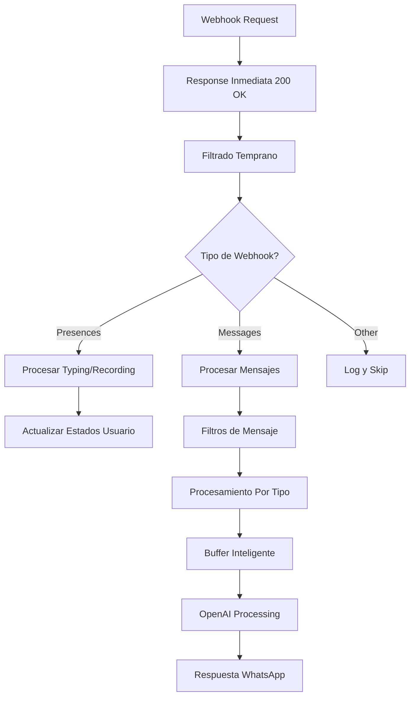

# 🔗 Pipeline de Procesamiento de Webhooks - Documentación Técnica Completa

## 📋 Resumen Ejecutivo

El **Pipeline de Procesamiento de Webhooks** es el sistema central que maneja todas las solicitudes entrantes de WhatsApp Business API vía WHAPI. Implementa un flujo sofisticado de **filtrado temprano**, **procesamiento asíncrono**, **rate limiting** y **recovery automático** para garantizar procesamiento confiable y eficiente de mensajes, presencias y eventos multimedia.

---

## 🏗️ Arquitectura General

### **Endpoint Principal**
```typescript
// Express endpoint en src/app-unified.ts
app.post('/hook', async (req: Request, res: Response) => {
    // Pipeline completo de procesamiento
});
```

### **Flujo de Alto Nivel**



---

## ⚡ Respuesta Inmediata y Procesamiento Asíncrono

### **Patrón Fire-and-Forget**

```typescript
app.post('/hook', async (req: Request, res: Response) => {
    // 1. RESPUESTA INMEDIATA - Crítico para WHAPI
    res.status(200).json({ status: 'received' });
    
    // 2. PROCESAMIENTO ASÍNCRONO
    setImmediate(async () => {
        try {
            await processWebhook(req.body);
        } catch (error) {
            // Error handling sin afectar respuesta HTTP
            logError('WEBHOOK_PROCESS_ERROR', 'Error procesando webhook', {
                error: error.message,
                bodyPreview: JSON.stringify(req.body).substring(0, 200)
            });
        }
    });
});
```

**Beneficios del Patrón**:
- ✅ **Respuesta inmediata** (< 50ms) a WHAPI
- ✅ **No bloqueo** del servidor durante procesamiento
- ✅ **Prevención de timeouts** de WHAPI
- ✅ **Escalabilidad** mejorada para múltiples webhooks

---

## 🔍 Filtrado Temprano y Clasificación

### **Detección de Tipo de Webhook**

```typescript
async function processWebhook(body: any) {
    const { messages, presences, event } = body;
    
    // 1. PRIORIDAD: Eventos de Presencia
    if (presences && event?.type === 'presences' && event?.event === 'post') {
        return await processPresenceEvents(presences);
    }
    
    // 2. PRIORIDAD: Mensajes
    if (messages && Array.isArray(messages)) {
        return await processMessages(messages);
    }
    
    // 3. OTROS WEBHOOKS VÁLIDOS
    const validWebhookTypes = [
        'statuses', 'chats', 'contacts', 'groups', 
        'labels', 'calls', 'channel', 'users'
    ];
    
    const isValidWebhook = validWebhookTypes.some(type => 
        body[type] && (Array.isArray(body[type]) || typeof body[type] === 'object')
    );
    
    if (isValidWebhook) {
        return await processOtherWebhook(body);
    }
    
    // 4. WEBHOOK INVÁLIDO - Rate Limited
    return await handleInvalidWebhook(body);
}
```

### **Rate Limiting de Webhooks Inválidos**

```typescript
// Rate limiting global para webhooks spam
const webhookCounts = new Map<string, { lastLog: number; count: number }>();

async function handleInvalidWebhook(body: any) {
    const webhookKey = 'invalid_webhook';
    const now = Date.now();
    const lastLog = webhookCounts.get(webhookKey)?.lastLog || 0;
    
    // Solo log cada minuto para webhooks inválidos
    if ((now - lastLog) > 60000) {
        logWarning('WEBHOOK_INVALID', 'Webhook recibido sin datos válidos', { 
            body: body,
            environment: appConfig.environment,
            note: 'Rate limited - solo se loggea una vez por minuto'
        });
        
        webhookCounts.set(webhookKey, { 
            lastLog: now, 
            count: (webhookCounts.get(webhookKey)?.count || 0) + 1 
        });
    }
}
```

---

## 👤 Procesamiento de Eventos de Presencia

### **Tipos de Presencia Detectados**

```typescript
// Estados de presencia de WhatsApp
const PRESENCE_STATES = {
    'typing': 'Usuario escribiendo texto',
    'recording': 'Usuario grabando nota de voz', 
    'online': 'Usuario en línea',
    'offline': 'Usuario desconectado',
    'pending': 'Usuario saliendo de la conversación'
};
```

### **Algoritmo de Procesamiento de Presencia**

```typescript
async function processPresenceEvents(presences: any[]) {
    logInfo('PRESENCE_EVENT', `Procesando ${presences.length} eventos de presencia`);
    
    presences.forEach((presence: { contact_id: string, status: string }) => {
        const userId = presence.contact_id;
        const status = presence.status.toLowerCase();
        const shortUserId = getShortUserId(userId);
        
        // 1. LOG DE TRACKING
        logInfo('PRESENCE_RECEIVED', `Presencia para ${shortUserId}: ${status}`, {
            userId: shortUserId,
            status,
            environment: appConfig.environment
        });
        
        // 2. PROCESAMIENTO POR TIPO
        if (status === 'typing' || status === 'recording') {
            handleActivePresence(userId, status);
        } else if (['online', 'offline', 'pending'].includes(status)) {
            handleInactivePresence(userId, status);
        }
    });
}

function handleActivePresence(userId: string, status: string) {
    // 1. Actualizar estado de usuario
    const userState = getOrCreateUserState(userId, `${userId}@s.whatsapp.net`, getShortUserId(userId));
    userState.lastTyping = Date.now();
    
    // 2. Gestión de buffer inteligente
    let buffer = globalMessageBuffers.get(userId);
    
    if (!buffer) {
        // Crear buffer vacío para mensajes futuros
        buffer = {
            messages: [],
            chatId: `${userId}@s.whatsapp.net`,
            userName: getShortUserId(userId),
            lastActivity: Date.now(),
            timer: null
        };
        globalMessageBuffers.set(userId, buffer);
    }
    
    // 3. CANCELAR TIMER ANTERIOR
    if (buffer.timer) {
        clearTimeout(buffer.timer);
    }
    
    // 4. CONFIGURAR TIMER EXTENDIDO (10s)
    buffer.timer = setTimeout(() => {
        const currentBuffer = globalMessageBuffers.get(userId);
        if (currentBuffer) {
            currentBuffer.timer = null;
            processGlobalBuffer(userId);
        }
    }, TYPING_EXTENDED_MS); // 10 segundos
}

function handleInactivePresence(userId: string, status: string) {
    // Solo mostrar si hay mensajes pendientes
    const buffer = globalMessageBuffers.get(userId);
    if (buffer && buffer.messages.length > 0) {
        const userName = buffer.userName || getShortUserId(userId);
        const userState = globalUserStates.get(userId);
        const wasVoiceInput = userState?.lastInputVoice === true;
        
        // Log visual en terminal
        console.log(`⏰ ${wasVoiceInput ? '🎙️' : '✍️'} ${userName} dejó de ${wasVoiceInput ? 'grabar' : 'escribir'}.`);
    }
}
```

---

## 💬 Procesamiento de Mensajes

### **Filtros de Mensaje Implementados**

```typescript
async function processMessages(messages: any[]) {
    logInfo('WEBHOOK_MESSAGES_DETECTED', `Procesando ${messages.length} mensajes`);
    
    for (const message of messages) {
        try {
            // FILTRO 1: Mensajes manuales de agentes
            if (await isManualAgentMessage(message)) {
                await processManualMessage(message);
                continue;
            }
            
            // FILTRO 2: Mensajes del bot (evitar loops)
            if (message.from_me && botSentMessages.has(message.id)) {
                logDebug('BOT_MESSAGE_FILTERED', `Mensaje del bot ignorado: ${message.id}`);
                continue;
            }
            
            // FILTRO 3: Mensajes from_me que no son manuales
            if (message.from_me) {
                logDebug('MESSAGE_SKIP', `Skipped bot message`, { 
                    id: message.id, 
                    from: message.from 
                });
                continue;
            }
            
            // FILTRO 4: Mensajes de usuario válidos
            if (isValidUserMessage(message)) {
                await processUserMessage(message);
            }
            
        } catch (error) {
            logError('MESSAGE_PROCESS_ERROR', 'Error procesando mensaje individual', {
                messageId: message.id,
                messageType: message.type,
                error: error.message
            });
        }
    }
}
```

### **Detección de Mensajes Manuales**

```typescript
async function isManualAgentMessage(message: any): Promise<boolean> {
    return message.from_me && 
           message.type === 'text' && 
           message.text?.body &&
           !botSentMessages.has(message.id);
}

async function processManualMessage(message: any) {
    const chatId = message.chat_id;
    const text = message.text.body.trim();
    const fromName = message.from_name || 'Agente';
    const shortClientId = getShortUserId(chatId);
    
    // 1. Verificar thread activo
    const threadRecord = threadPersistence.getThread(shortClientId);
    if (!threadRecord) {
        logWarning('MANUAL_NO_THREAD', `No hay conversación activa`, { 
            shortClientId: shortClientId,
            agentName: fromName,
            reason: 'cliente_debe_escribir_primero'
        });
        return;
    }
    
    // 2. Log detallado
    logInfo('MANUAL_DETECTED', `Mensaje manual del agente detectado`, {
        shortClientId: shortClientId,
        agentName: fromName,
        messageText: text.substring(0, 100),
        messageLength: text.length,
        timestamp: new Date().toISOString(),
        chatId: chatId
    });
    
    // 3. Buffer con timer de 5 segundos
    await addToManualBuffer(chatId, text, fromName, threadRecord);
}
```

### **Procesamiento de Mensajes de Usuario**

```typescript
async function processUserMessage(message: any) {
    const userId = message.from;
    const chatId = message.chat_id;
    
    // 1. Determinar nombre de usuario
    let userName = message.chat_name || cleanContactName(message.from_name);
    if (!userName || userName === 'Usuario') {
        userName = cleanContactName(message.from_name) || getShortUserId(userId);
    }
    
    // 2. Procesamiento por tipo de mensaje
    switch (message.type) {
        case 'image':
            await processImageMessage(message, userId, chatId, userName);
            break;
        case 'voice':
        case 'audio': 
        case 'ptt':
            await processVoiceMessage(message, userId, chatId, userName);
            break;
        case 'text':
            await processTextMessage(message, userId, chatId, userName);
            break;
        default:
            logWarning('UNSUPPORTED_MESSAGE_TYPE', `Tipo de mensaje no soportado: ${message.type}`, {
                messageId: message.id,
                userId: getShortUserId(userId),
                messageType: message.type
            });
    }
}
```

---

## 🎨 Procesamiento Multimedia

### **Procesamiento de Imágenes**

```typescript
async function processImageMessage(message: any, userId: string, chatId: string, userName: string) {
    // 1. Log visual
    terminalLog.image(userName);
    
    // 2. Obtener URL de imagen
    const imageUrl = message.image?.link;
    if (!imageUrl) {
        logError('IMAGE_NO_URL', 'Imagen sin URL válida', {
            messageId: message.id,
            userId: getShortUserId(userId)
        });
        return;
    }
    
    // 3. Validar URL y accesibilidad
    try {
        const urlResponse = await fetch(imageUrl, { method: 'HEAD' });
        if (!urlResponse.ok) {
            throw new Error(`HTTP ${urlResponse.status}`);
        }
    } catch (error) {
        terminalLog.imageError(userName, `URL no accesible: ${error.message}`);
        logError('IMAGE_URL_ERROR', 'Error validando URL de imagen', {
            userId: getShortUserId(userId),
            imageUrl,
            error: error.message
        });
        return;
    }
    
    // 4. Agregar a buffer de imágenes pendientes
    if (!pendingImages.has(userId)) {
        pendingImages.set(userId, []);
    }
    pendingImages.get(userId)!.push(imageUrl);
    
    // 5. Agregar placeholder al buffer de mensajes
    addToGlobalBuffer(
        userId, 
        `📷 [IMAGEN]: ${message.image?.caption || 'Sin descripción'}`, 
        chatId, 
        userName
    );
}
```

### **Procesamiento de Audio/Voz**

```typescript
async function processVoiceMessage(message: any, userId: string, chatId: string, userName: string) {
    // 1. Log visual
    terminalLog.voice(userName);
    
    // 2. Verificar si transcripción está habilitada
    if (process.env.ENABLE_VOICE_TRANSCRIPTION !== 'true') {
        addToGlobalBuffer(userId, '🎤 [NOTA DE VOZ]: Transcripción deshabilitada', chatId, userName, true);
        return;
    }
    
    try {
        // 3. Obtener URL del audio
        const audioUrl = message.voice?.link || message.audio?.link || message.ptt?.link;
        
        if (!audioUrl) {
            addToGlobalBuffer(userId, '🎤 [NOTA DE VOZ]: Sin URL de audio', chatId, userName, true);
            return;
        }
        
        // 4. Transcribir usando Whisper API
        const transcription = await transcribeAudio(audioUrl, userId, userName, message.id);
        const audioText = `🎤 [NOTA DE VOZ]: ${transcription}`;
        
        // 5. Log limpio en terminal
        terminalLog.message(userName, transcription);
        
        // 6. Agregar al buffer con flag de voz
        addToGlobalBuffer(userId, audioText, chatId, userName, true); // true = es voz
        
    } catch (error) {
        terminalLog.voiceError(userName, error.message);
        logError('VOICE_TRANSCRIPTION_ERROR', 'Error transcribiendo audio', {
            userId: getShortUserId(userId),
            error: error.message
        });
        
        // Fallback
        addToGlobalBuffer(userId, '🎤 [NOTA DE VOZ]: Error en transcripción', chatId, userName, true);
    }
}
```

### **Procesamiento de Texto**

```typescript
async function processTextMessage(message: any, userId: string, chatId: string, userName: string) {
    const text = message.text.body.trim();
    
    // 1. Log limpio en terminal
    terminalLog.message(userName, text);
    
    // 2. Agregar al buffer global
    addToGlobalBuffer(userId, text, chatId, userName);
}
```

---

## 🔄 Buffer Inteligente y Timing

### **Integración con Sistema de Buffer**

```typescript
function addToGlobalBuffer(
    userId: string, 
    message: string, 
    chatId: string, 
    userName: string, 
    isVoice: boolean = false
): void {
    const shortUserId = getShortUserId(userId);
    let buffer = globalMessageBuffers.get(shortUserId);
    
    if (!buffer) {
        // CREAR NUEVO BUFFER
        buffer = {
            messages: [message],
            chatId,
            userName,
            lastActivity: Date.now(),
            timer: null
        };
        globalMessageBuffers.set(shortUserId, buffer);
        
        // DETERMINAR VENTANA DE TIEMPO
        const bufferWindow = determineBufferWindow(userId);
        
        // LOGS
        logInfo('GLOBAL_BUFFER_CREATE', 'Buffer creado', {
            shortUserId,
            initialMessage: message.substring(0, 50),
            bufferWindow,
            isVoice
        });
        
        // PROGRAMAR PROCESAMIENTO
        buffer.timer = setTimeout(() => {
            processGlobalBuffer(shortUserId);
        }, bufferWindow);
        
    } else {
        // AGREGAR A BUFFER EXISTENTE
        buffer.messages.push(message);
        buffer.lastActivity = Date.now();
        
        logInfo('GLOBAL_BUFFER_ADD', 'Mensaje agregado al buffer', {
            shortUserId,
            messageCount: buffer.messages.length,
            newMessage: message.substring(0, 50)
        });
    }
}

function determineBufferWindow(userId: string): number {
    const userState = globalUserStates.get(userId);
    
    // Si hay typing reciente (menos de 10s), usar ventana extendida
    if (userState?.lastTyping && 
        (Date.now() - userState.lastTyping < TYPING_EXTENDED_MS)) {
        return TYPING_EXTENDED_MS;  // 10 segundos
    }
    
    return BUFFER_WINDOW_MS;  // 5 segundos por defecto
}
```

---

## 🔐 Control de Concurrencia y Race Conditions

### **Prevención de Procesamiento Duplicado**

```typescript
// Control global de procesamiento activo
const activeProcessing = new Set<string>();

async function processGlobalBuffer(shortUserId: string): Promise<void> {
    // 1. VERIFICAR SI YA SE ESTÁ PROCESANDO
    if (activeProcessing.has(shortUserId)) {
        logWarning('BUFFER_ALREADY_PROCESSING', 'Buffer ya en procesamiento', {
            shortUserId,
            reason: 'race_condition_prevention'
        });
        return;
    }
    
    // 2. MARCAR COMO ACTIVO
    activeProcessing.add(shortUserId);
    
    try {
        const buffer = globalMessageBuffers.get(shortUserId);
        if (!buffer || buffer.messages.length === 0) {
            return;
        }
        
        // 3. COMBINAR MENSAJES
        const combinedMessage = buffer.messages.join('\n');
        
        // 4. LIMPIAR BUFFER
        if (buffer.timer) {
            clearTimeout(buffer.timer);
        }
        globalMessageBuffers.delete(shortUserId);
        
        // 5. PROCESAR CON OPENAI
        await processWithOpenAI(
            buffer.chatId,
            combinedMessage,
            buffer.userName,
            shortUserId
        );
        
    } finally {
        // 6. LIBERAR LOCK
        activeProcessing.delete(shortUserId);
    }
}
```

### **Manejo de Backoff para OpenAI**

```typescript
async function processWithOpenAI(chatId: string, userMsg: string, userName: string, userJid: string) {
    let addAttempts = 0;
    const maxAddAttempts = 15;
    
    while (addAttempts < maxAddAttempts) {
        try {
            // Verificar runs activos
            const existingRuns = await openaiClient.beta.threads.runs.list(threadId, { limit: 5 });
            const activeRuns = existingRuns.data.filter(r => 
                ['queued', 'in_progress', 'requires_action'].includes(r.status)
            );
            
            if (activeRuns.length > 0) {
                // BACKOFF PROGRESIVO (1s, 2s, 3s...)
                const backoffDelay = Math.min((addAttempts + 1) * 1000, 5000); // Máximo 5s
                
                logWarning('ACTIVE_RUN_BEFORE_ADD', `Run activo detectado, esperando con backoff...`, {
                    shortUserId: userJid,
                    threadId,
                    activeRuns: activeRuns.map(r => ({ id: r.id, status: r.status })),
                    attempt: addAttempts + 1,
                    backoffDelay
                });
                
                await new Promise(resolve => setTimeout(resolve, backoffDelay));
                addAttempts++;
                continue;
            }
            
            // Procesar normalmente
            await processMessageWithOpenAI(threadId, userMsg, userJid);
            break;
            
        } catch (addError) {
            if (addError.message?.includes('while a run') && addError.message?.includes('is active')) {
                // RACE CONDITION DETECTADA
                const backoffDelay = Math.min((addAttempts + 1) * 1000, 5000);
                
                logWarning('RACE_CONDITION_RETRY', `Race condition detectada, reintentando con backoff...`, {
                    shortUserId: userJid,
                    threadId,
                    attempt: addAttempts + 1,
                    backoffDelay,
                    error: addError.message
                });
                
                await new Promise(resolve => setTimeout(resolve, backoffDelay));
                addAttempts++;
                
                if (addAttempts >= maxAddAttempts) {
                    throw new Error(`Race condition persistente después de ${maxAddAttempts} intentos`);
                }
            } else {
                throw addError; // Re-throw otros errores
            }
        }
    }
}
```

---

## 📊 Logging y Monitoreo

### **Categorías de Logs Implementadas**

| Categoría | Propósito | Nivel |
|-----------|-----------|-------|
| `WEBHOOK_PROCESS_START` | Inicio de procesamiento | INFO |
| `WEBHOOK_PROCESS_END` | Fin exitoso | INFO |
| `WEBHOOK_PROCESS_ERROR` | Error general | ERROR |
| `PRESENCE_EVENT` | Eventos de presencia | INFO |
| `PRESENCE_RECEIVED` | Presencia individual | INFO |
| `WEBHOOK_MESSAGES_DETECTED` | Detección de mensajes | INFO |
| `MANUAL_DETECTED` | Mensaje manual detectado | INFO |
| `BOT_MESSAGE_FILTERED` | Mensaje del bot filtrado | DEBUG |
| `MESSAGE_SKIP` | Mensaje skipeado | DEBUG |
| `WEBHOOK_INVALID` | Webhook inválido | WARNING |
| `GLOBAL_BUFFER_CREATE` | Creación de buffer | INFO |
| `GLOBAL_BUFFER_ADD` | Agregado a buffer | INFO |
| `ACTIVE_RUN_BEFORE_ADD` | Run activo detectado | WARNING |
| `RACE_CONDITION_RETRY` | Retry por race condition | WARNING |

### **Métricas de Performance**

```typescript
// Métricas recolectadas automáticamente
const webhookMetrics = {
    totalWebhooks: 0,
    validWebhooks: 0,
    invalidWebhooks: 0,
    messageWebhooks: 0,
    presenceWebhooks: 0,
    processingTime: [], // Array de tiempos
    errorCount: 0,
    raceConditions: 0,
    backoffRetries: 0
};

// Tracking automático en cada webhook
function trackWebhookMetrics(type: string, processingTime: number, hadError: boolean) {
    webhookMetrics.totalWebhooks++;
    webhookMetrics.processingTime.push(processingTime);
    
    if (hadError) webhookMetrics.errorCount++;
    
    switch (type) {
        case 'messages': webhookMetrics.messageWebhooks++; break;
        case 'presences': webhookMetrics.presenceWebhooks++; break;
        case 'valid': webhookMetrics.validWebhooks++; break;
        case 'invalid': webhookMetrics.invalidWebhooks++; break;
    }
}
```

---

## 🔧 Configuraciones y Variables de Entorno

### **Variables de Control**

```bash
# Transcripción de voz
ENABLE_VOICE_TRANSCRIPTION=true    # Habilitar Whisper API

# Logging
TERMINAL_LOGS_FUNCTIONS=true       # Logs de funciones en terminal

# Timing de buffers (hardcoded - no configurable)
# BUFFER_WINDOW_MS=5000            # No existe como ENV
# TYPING_EXTENDED_MS=10000         # No existe como ENV

# Rate limiting
# WEBHOOK_RATE_LIMIT_MS=60000      # No existe como ENV
```

### **Configuración de WHAPI**

```typescript
// Headers requeridos para WHAPI
const whapiConfig = {
    baseURL: process.env.WHAPI_BASE_URL,
    token: process.env.WHAPI_TOKEN,
    timeout: 30000,
    retries: 3
};
```

---

## ⚠️ Limitaciones y Consideraciones

### **1. Memoria de Rate Limiting**
- `webhookCounts` Map crece indefinidamente
- No hay limpieza automática de entradas antiguas
- **Impacto**: Memory leak potencial en uso prolongado

### **2. Concurrencia Limitada**
- `activeProcessing` Set previene procesamiento paralelo por usuario
- Puede causar delays si un usuario envía mensajes muy frecuentemente
- **Beneficio**: Evita race conditions y respuestas desordenadas

### **3. Buffer de Imágenes Temporal**
- `pendingImages` Map no tiene límite de tamaño
- Imágenes se acumulan hasta el próximo mensaje de texto
- **Riesgo**: Memory leak si usuario envía solo imágenes

### **4. Dependencia de WHAPI**
- Sistema altamente acoplado a formato específico de WHAPI
- Cambios en API de WHAPI pueden romper el pipeline
- **Mitigación**: Versionado de API y tests de compatibilidad

### **5. Procesamiento Secuencial**
- Mensajes se procesan uno por uno dentro de cada webhook
- No paralelización entre mensajes del mismo webhook
- **Razón**: Mantener orden cronológico correcto

---

## 🚀 Optimizaciones Implementadas

### **1. Response Inmediata**
- Respuesta HTTP 200 antes de procesamiento
- Previene timeouts de WHAPI
- Mejora percepción de velocidad

### **2. Rate Limiting Inteligente**
- Solo webhooks inválidos son rate limited
- Mensajes válidos se procesan siempre
- Previene spam de logs

### **3. Filtrado Multi-Nivel**
- Filtro por tipo de webhook
- Filtro por tipo de mensaje  
- Filtro por origen (bot vs usuario vs agente)
- Reduce procesamiento innecesario

### **4. Buffer Inteligente Integrado**
- Timing dinámico basado en presencia
- Agrupación automática de mensajes
- Mejor experiencia conversacional

### **5. Backoff Progresivo**
- Incremento gradual de delays
- Máximo 5 segundos de espera
- 15 intentos antes de fallar

---

## 📝 Recomendaciones de Desarrollo

### **✅ Fortalezas a Mantener**
1. **Response inmediata** - Crítica para WHAPI
2. **Filtrado multi-nivel** - Previene procesamiento innecesario
3. **Rate limiting de spam** - Protege recursos del sistema
4. **Backoff progresivo** - Manejo robusto de race conditions
5. **Logging comprehensivo** - Facilita debugging y monitoreo

### **⚠️ Áreas de Mejora**

#### **1. Cleanup de Memoria**
```typescript
// Propuesta: Limpieza periódica de caches
setInterval(() => {
    const now = Date.now();
    const maxAge = 60 * 60 * 1000; // 1 hora
    
    // Limpiar webhook counts
    for (const [key, data] of webhookCounts.entries()) {
        if (now - data.lastLog > maxAge) {
            webhookCounts.delete(key);
        }
    }
    
    // Limpiar active processing (fallback)
    activeProcessing.clear(); // Reset cada hora como fallback
    
}, 60 * 60 * 1000); // Cada hora
```

#### **2. Configurabilidad Avanzada**
```typescript
// Propuesta: Variables de entorno para timing
const config = {
    bufferWindowMs: parseInt(process.env.BUFFER_WINDOW_MS) || 5000,
    typingExtendedMs: parseInt(process.env.TYPING_EXTENDED_MS) || 10000,
    webhookRateLimitMs: parseInt(process.env.WEBHOOK_RATE_LIMIT_MS) || 60000,
    maxRetries: parseInt(process.env.MAX_OPENAI_RETRIES) || 15,
    maxBackoffMs: parseInt(process.env.MAX_BACKOFF_MS) || 5000
};
```

#### **3. Métricas Avanzadas**
```typescript
// Propuesta: Endpoint de métricas
app.get('/metrics', (req, res) => {
    const avgProcessingTime = webhookMetrics.processingTime.length > 0 
        ? webhookMetrics.processingTime.reduce((a, b) => a + b) / webhookMetrics.processingTime.length 
        : 0;
    
    res.json({
        totalWebhooks: webhookMetrics.totalWebhooks,
        avgProcessingTimeMs: Math.round(avgProcessingTime),
        errorRate: webhookMetrics.errorCount / webhookMetrics.totalWebhooks,
        bufferSize: globalMessageBuffers.size,
        activeProcessing: activeProcessing.size,
        memoryUsage: process.memoryUsage()
    });
});
```

#### **4. Circuit Breaker Pattern**
```typescript
// Propuesta: Circuit breaker para OpenAI
class CircuitBreaker {
    private failures = 0;
    private lastFailure = 0;
    private state: 'CLOSED' | 'OPEN' | 'HALF_OPEN' = 'CLOSED';
    
    async execute<T>(operation: () => Promise<T>): Promise<T> {
        if (this.state === 'OPEN') {
            if (Date.now() - this.lastFailure > 60000) { // 1 min
                this.state = 'HALF_OPEN';
            } else {
                throw new Error('Circuit breaker is OPEN');
            }
        }
        
        try {
            const result = await operation();
            this.onSuccess();
            return result;
        } catch (error) {
            this.onFailure();
            throw error;
        }
    }
    
    private onSuccess() {
        this.failures = 0;
        this.state = 'CLOSED';
    }
    
    private onFailure() {
        this.failures++;
        this.lastFailure = Date.now();
        
        if (this.failures >= 5) {
            this.state = 'OPEN';
        }
    }
}
```

---

## 🎯 Conclusión

El **Pipeline de Procesamiento de Webhooks** es un sistema **altamente optimizado** que maneja eficientemente el flujo completo desde la recepción de webhooks hasta la respuesta final. Su arquitectura asíncrona, filtrado multi-nivel y manejo robusto de errores lo convierten en una pieza fundamental del bot.

**Fortalezas principales**:
- ✅ **Response inmediata** (< 50ms) crítica para WHAPI
- ✅ **Filtrado inteligente** reduce procesamiento innecesario
- ✅ **Rate limiting** protege contra spam
- ✅ **Backoff progresivo** maneja race conditions robustamente
- ✅ **Logging comprehensivo** facilita debugging y monitoreo

**Oportunidades de mejora**:
- ⚠️ **Memory management** - Cleanup automático de caches
- ⚠️ **Configurabilidad** - Variables ENV para timing
- ⚠️ **Métricas** - Endpoint de health y performance  
- ⚠️ **Circuit breaker** - Protección contra fallos cascada

**Estado actual**: ✅ **Arquitecturalmente sólido** y funcionalmente robusto, con oportunidades de optimización para ambientes de alta carga y monitoreo avanzado.

---

**Referencias de Código**:
- `src/app-unified.ts:3100-3500` - Función `processWebhook()`
- `src/app-unified.ts:3106-3170` - Procesamiento de presencia
- `src/app-unified.ts:3226-3400` - Procesamiento de mensajes
- `src/app-unified.ts:2080-2200` - Backoff progresivo OpenAI