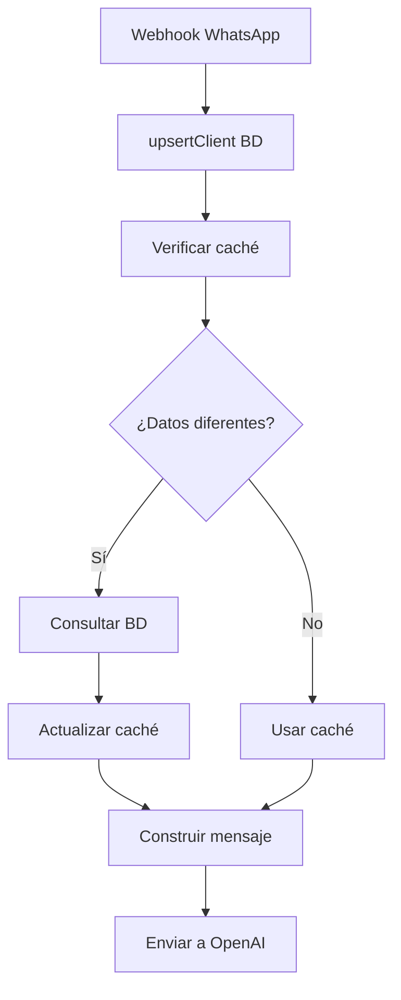

# Bot Core - Sistema de Procesamiento de Mensajes

## 📍 Ubicación
`src/core/bot.ts` - Núcleo principal del bot

## 🎯 Propósito
Procesa mensajes de WhatsApp con contexto completo del cliente extraído de la base de datos y caché inteligente.

## 🔄 Flujo de Procesamiento de Mensajes

### 1. **Recepción del Webhook**
```
Webhook → WebhookProcessor → BufferManager → Bot.processBufferCallback()
```

### 2. **Sistema de Caché Inteligente**

#### ⏰ **Configuración del Caché**
- **Duración**: 30 minutos
- **Capacidad**: 1000 clientes máximo
- **Archivo**: `src/core/state/client-data-cache.ts`

#### 🔍 **Cuándo se actualiza el caché**:
1. **📞 Nombre diferente**: Webhook nombre ≠ caché
2. **🏷️ Etiquetas diferentes**: Webhook etiquetas ≠ caché  
3. **⏰ Datos antiguos**: > 30 minutos desde último caché
4. **❌ Sin caché**: No existe entrada en caché

#### 💾 **Datos almacenados en caché**:
```typescript
interface ClientData {
    phoneNumber: string;
    name: string | null;          // Nombre real del cliente
    userName: string | null;      // Nombre de WhatsApp
    labels: string[];             // Etiquetas del cliente
    chatId: string | null;        // ID del chat
    lastActivity: Date;           // Última actividad
    cachedAt: Date;              // Cuándo se guardó en caché
    needsSync: boolean;          // Si necesita sincronización
}
```

### 3. **Sincronización Automática BD ↔ Caché**

#### 📡 **Actualización desde Webhook** (`webhook-processor.ts:250`)
```typescript
// Cada mensaje actualiza BD automáticamente
await this.databaseService.upsertClient({
    phoneNumber,
    userName,        // ← Fallback legacy (se usa si no hay from_name)
    chatId,
    lastActivity: new Date(),
    chat_name,       // ← Nombre del contacto guardado en WhatsApp
    from_name        // ← Display name del perfil de WhatsApp
});
```

#### 🔄 **Verificación y Consulta BD** (`bot.ts:207`)
```typescript
// Si caché vacío o datos desactualizados
if (!clientData || this.clientDataCache.needsUpdate(userId, userName)) {
    // Consultar BD y actualizar caché
    const existingUser = await this.databaseService.findUserByPhoneNumber(userId);
    const dbClientData = await this.databaseService.getThread(userId);
    
    // Actualizar caché con datos frescos
    this.clientDataCache.updateFromDatabase(userId, {
        name: user?.name || null,
        userName: user?.userName || userName || null,
        labels: dbClientData.labels || [],
        chatId: dbClientData.chatId,
        lastActivity: dbClientData.lastActivity
    });
}
```

### 4. **Construcción del Mensaje Contextual**

#### 📝 **Datos extraídos de BD** (`bot.ts:628`)
```typescript
private buildContextualMessage(
    userName: string, 
    displayName: string | null, 
    labels: string[], 
    message: string
): string {
    const fullName = displayName && displayName !== userName 
        ? `${displayName} / ${userName}` 
        : userName;
    
    const labelsText = labels.length > 0 
        ? labels.join(', ') 
        : 'Sin etiquetas';
    
    const contextualMessage = `Nombre y username del contacto: ${fullName}
Etiquetas internas actuales: ${labelsText}
Fecha y hora actual: ${colombianTime}

Mensaje del cliente:
${message}`;
}
```

#### 🤖 **Mensaje enviado a OpenAI**
```
Nombre y username del contacto: Sr Alex / Usuario
Etiquetas internas actuales: VIP, Corporativo
Fecha y hora actual: 3 ago 2025, 2:45 p.m.

Mensaje del cliente:
probando, probando
```

## 🗄️ **Datos de BD Disponibles**

### 📋 **Esquema Chats (antes ClientView)** (`prisma/schema.prisma`)
```typescript
model WhatsApp {
  // IDENTIFICACIÓN
  phoneNumber         String   @id
  name                String?  // chat_name: Nombre del contacto guardado
  userName            String?  // from_name: Display name del perfil WhatsApp
  
  // ETIQUETAS
  labels              String?  // Etiquetas concatenadas con '/'
  
  // CONTACTO
  chatId              String?  // ID del chat
  lastActivity        DateTime // Última actividad
  threadId            String?  // Thread OpenAI
  
  // CRM AUTOMATIZADO
  profileStatus       String?   // Resumen del cliente
  proximaAccion       String?   // Acción sugerida
  fechaProximaAccion  DateTime? // Fecha de acción
  prioridad           Int?      // 1=Alta, 2=Media, 3=Baja
}
```

## 🔄 **Flujo Completo de Sincronización**



## 🎯 **Ventajas del Sistema**

1. **⚡ Performance**: Caché evita consultas innecesarias a BD
2. **🔄 Sincronización**: Datos siempre actualizados automáticamente
3. **🤖 Contexto Rico**: OpenAI recibe información completa del cliente
4. **📊 Escalabilidad**: LRU Cache con límites configurable
5. **🛡️ Fallback**: Sistema de memoria si BD falla

## 🔧 **Configuración**

### **Variables de Caché** (`client-data-cache.ts`)
```typescript
constructor(
    maxClients: number = 1000,           // Máximo clientes en caché
    clientTTL: number = 30 * 60 * 1000   // TTL: 30 minutos
)
```

### **Logs de Debugging**
- `CACHE_HIT`: Datos obtenidos del caché
- `CACHE_MISS`: Consultando BD por datos desactualizados
- `OPENAI_MESSAGE_PREPARED`: Mensaje final enviado a OpenAI

## 🚀 **Casos de Uso**

### **Cliente Nuevo**
1. Webhook llega → `upsertClient()` crea en BD
2. Caché vacío → Consulta BD → Crea caché
3. OpenAI recibe: "Usuario / 573003913251, Sin etiquetas"

### **Cliente Existente - Caché Válido**
1. Webhook llega → `upsertClient()` actualiza BD
2. Caché válido (< 30min) → Usa caché directamente
3. OpenAI recibe: "Sr Alex / Usuario, VIP, Corporativo"

### **Cliente Existente - Caché Vencido**
1. Webhook llega → `upsertClient()` actualiza BD  
2. Caché > 30min → Consulta BD → Actualiza caché
3. OpenAI recibe datos frescos de BD

### **Cambio de Nombre**
1. Usuario cambia nombre en WhatsApp
2. Webhook trae nuevo nombre ≠ caché
3. `needsUpdate()` detecta diferencia → Actualiza BD y caché
4. OpenAI recibe nuevo nombre inmediatamente