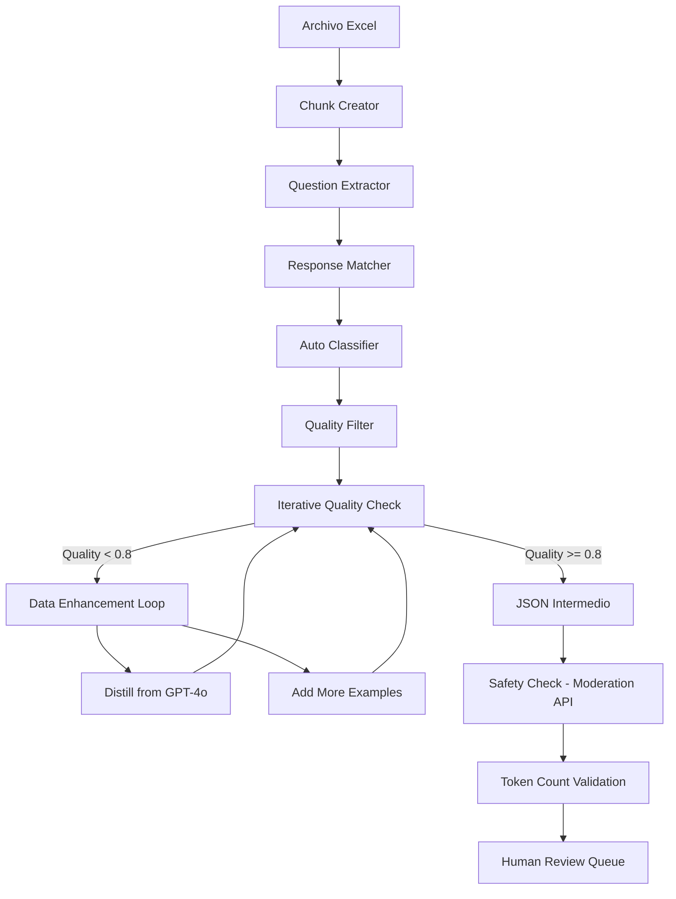

# 🚀 PLAN TÉCNICO DETALLADO: DATASET PARA FINE-TUNING DE IA HOTELERA
**Extracción y Clasificación de Conversaciones WhatsApp para Entrenamiento**

## 📊 ANÁLISIS DE DATOS INICIAL
- **196,152 mensajes** totales en 3 hojas Excel
- **Estructura identificada**: `[teléfono, fecha/hora, tipo, mensaje]`
- **Solo mensajes "Received"**: Preguntas de huéspedes hacia hotel
- **Período histórico**: 2021-2024 (3 años de conversaciones reales)
- **Tamaño archivos**: 6.8MB (XLS) + 4.2MB (XLSX)

---

## 🎯 OBJETIVO FINAL
Transformar conversaciones reales en dataset estructurado formato **JSONL** optimizado para:
- **Supervised Fine-Tuning (SFT)** con OpenAI/Hugging Face
- **Clasificación automática** de tipos de preguntas
- **Generación de respuestas** contextualizadas y profesionales

---

## 🧪 FASE 0: EVALUACIONES BASELINE (NUEVA)
*Duración estimada: 1-2 horas*
*Basado en "Evals are the foundation" de OpenAI*

### 0.1 Establecimiento de Baseline 📊
**CRÍTICO**: Evaluar performance inicial antes de invertir en fine-tuning

#### Scripts a crear:
```javascript
// build-evals.js
const EVAL_CONFIG = {
  sample_size: 200, // 10-20% de datos para evaluación inicial
  baseline_model: "gpt-4o-mini", // Modelo base para comparar
  metrics: ["accuracy", "f1_score", "response_quality"],
  categories_to_test: "all", // Todas las categorías principales
  eval_method: "llm_judge" // Usar otro modelo OpenAI para scoring
};

const BASELINE_PROMPTS = {
  simple: "Eres un asistente de hotel. Responde esta pregunta: {question}",
  detailed: "Eres un asistente experto de hotel. Contexto: hotel boutique en la costa. Pregunta del huésped: {question}. Responde de manera profesional y completa.",
  few_shot: "Eres asistente hotelero. Ejemplos:\nP: ¿Hay WiFi? R: Sí, WiFi gratuito en todo el hotel.\nP: {question} R:"
};
```

#### Acciones:
1. ✅ **Crear dataset de evaluación** → Muestra aleatoria estratificada
2. ✅ **Ejecutar baseline con prompts** → Probar 3 variaciones de prompt
3. ✅ **Métricas automáticas** → Accuracy y F1-score por categoría
4. ✅ **LLM-as-Judge evaluation** → Usar gpt-4o para evaluar calidad
5. ✅ **Umbral de decisión** → Si baseline >85%, considerar solo prompt engineering

### 0.2 Criterios de Continuidad 🎯
```javascript
const DECISION_THRESHOLDS = {
  proceed_with_finetuning: {
    accuracy: "< 80%", // Si accuracy < 80%, proceder con fine-tuning
    consistency: "< 85%", // Si consistencia < 85%, necesitamos más datos
    category_gaps: "> 3", // Si >3 categorías con <70% accuracy
  },
  prompt_engineering_sufficient: {
    accuracy: "> 90%", // Si >90%, solo mejorar prompts
    consistency: "> 95%", // Si muy consistente, no necesita fine-tuning
  }
};
```

---

## 📋 FASE 1: PREPARACIÓN Y FUNDAMENTOS
*Duración estimada: 2-3 horas*

### 1.1 Consolidación y Anonimización 🔒
**CRÍTICO**: Protección de datos personales antes de procesamiento

#### Scripts a crear:
```javascript
// anonymize-data.js
const ANONYMIZATION_RULES = {
  phones: /\b\d{10,15}\b/g → "TELEFONO_XXX",
  emails: /\b[A-Za-z0-9._%+-]+@[A-Za-z0-9.-]+\.[A-Z|a-z]{2,}\b/g → "EMAIL_XXX",
  names: /\b[A-Z][a-z]+\s[A-Z][a-z]+\b/g → "HUESPED_NOMBRE",
  ids: /\b\d{6,10}\b/g → "ID_XXX"
};
```

#### Acciones:
1. ✅ **Unificar archivos Excel** → `conversaciones_completas.json`
2. ✅ **Script anonimización** → Reemplazar PII automáticamente
3. ✅ **Backup seguro** → Archivos originales en carpeta `_originales/`
4. ✅ **Validación manual** → Revisar 100 mensajes aleatorios

### 1.2 Taxonomía de Categorías Mejorada 📚
**Base para clasificación automática y manual + Few-shot examples**
*Incorporando "Provide example outputs" de OpenAI*

```json
{
  "categorias_principales": {
    "reservas_disponibilidad": {
      "keywords": ["disponible", "libre", "reservar", "fecha", "noches", "ocupado"],
      "ejemplos": ["¿Tienes disponible para el fin de semana?", "Está libre del 15 al 20?"],
      "prompt_examples": [
        "Incluir fechas específicas y opciones alternativas si no está disponible",
        "Mencionar políticas de reserva y proceso de confirmación",
        "Ofrecer proactivamente información sobre tarifas si aplica"
      ],
      "respuesta_ideal_template": "Para [fechas], tenemos disponibilidad en [tipo_habitacion]. Tarifa: [precio] por noche. ¿Te gustaría que proceda con la reserva?"
    },
    "precios_cotizaciones": {
      "keywords": ["precio", "costo", "valor", "tarifa", "cuánto", "total"],
      "ejemplos": ["¿Cuál es el precio por noche?", "Cuánto me sale todo?"],
      "prompt_examples": [
        "Incluir desglose de costos (habitación, impuestos, servicios)",
        "Mencionar políticas de pago y descuentos disponibles",
        "Ofrecer diferentes opciones de habitación si es relevante"
      ],
      "respuesta_ideal_template": "La tarifa para [periodo] es [precio_base] + [impuestos]. Total: [precio_total]. Incluye [servicios]. ¿Necesitas información sobre formas de pago?"
    },
    "checkin_checkout": {
      "keywords": ["llegada", "salida", "hora", "check", "entrega", "llaves"],
      "ejemplos": ["¿A qué hora puedo llegar?", "¿Cómo es el proceso de entrada?"]
    },
    "servicios_amenidades": {
      "keywords": ["wifi", "desayuno", "piscina", "parqueadero", "aire", "toallas"],
      "ejemplos": ["¿Hay WiFi?", "¿El desayuno está incluido?"]
    },
    "pagos_medios": {
      "keywords": ["pago", "tarjeta", "efectivo", "nequi", "daviplata", "transferencia"],
      "ejemplos": ["¿Aceptan tarjeta?", "¿Puedo pagar con Nequi?"]
    },
    "ubicacion_transporte": {
      "keywords": ["ubicación", "dirección", "lejos", "cerca", "transporte", "uber"],
      "ejemplos": ["¿Qué tan lejos está de la playa?", "¿Cómo llego desde el aeropuerto?"]
    },
    "politicas_normas": {
      "keywords": ["política", "reglas", "mascota", "cancelación", "fumador", "niños"],
      "ejemplos": ["¿Puedo llevar mi perro?", "¿Cuál es la política de cancelación?"]
    },
    "problemas_quejas": {
      "keywords": ["problema", "daño", "sucio", "no funciona", "ayuda", "falla"],
      "ejemplos": ["El aire no enfría", "Hay problema con la ducha"]
    },
    "recomendaciones_locales": {
      "keywords": ["restaurante", "actividad", "lugar", "recomiendas", "qué hacer"],
      "ejemplos": ["¿Qué restaurante me recomiendas?", "¿Qué hacer cerca?"]
    },
    "post_estancia": {
      "keywords": ["factura", "recibo", "olvidé", "encontraron", "feedback"],
      "ejemplos": ["¿Me envías la factura?", "Olvidé mi cargador"]
    }
  }
}
```

### 1.3 Estructura de Output JSON Mejorada 🏗️
*Incorporando validaciones de token limits y formatos OpenAI*

```json
{
  "id": "CONV_001_Q_01",
  "metadata": {
    "telefono_anonimo": "TELEFONO_001",
    "fecha_original": "08/28/2024 15:28:18",
    "hoja_origen": "Chats-1",
    "fila_origen": 1234
  },
  "contenido": {
    "pregunta_original": "hola buenas, una pregunta, el apto tiene wifi?",
    "pregunta_estandarizada": "¿El apartamento cuenta con conexión WiFi?",
    "respuesta_original": "Hola! Si claro, la clave es Verano2025",
    "respuesta_ideal": "¡Hola! Sí, el apartamento cuenta con conexión WiFi de alta velocidad. La red es 'NombreRed' y la contraseña es 'ClaveSegura'. ¿Necesitas ayuda con algo más?",
    "respuesta_distilled": null // Respuesta generada por modelo grande (opcional)
  },
  "clasificacion": {
    "categoria_principal": "servicios_amenidades",
    "categoria_secundaria": "wifi_internet",
    "keywords_detectadas": ["wifi", "internet", "clave"],
    "confianza_clasificacion": 0.95,
    "llm_judge_score": 0.92 // Score de LLM-as-judge para curación
  },
  "metadatos_entrenamiento": {
    "calidad_pregunta": "alta|media|baja",
    "calidad_respuesta": "alta|media|baja",
    "requiere_revision": false,
    "notas_humano": "",
    "token_count": 45, // Conteo de tokens para validar límites
    "safety_check_passed": true, // Validación con OpenAI Moderation API
    "format_validation": "openai_chat_completion" // Formato target
  },
  "openai_format": {
    "messages": [
      {"role": "user", "content": "¿El apartamento cuenta con conexión WiFi?"},
      {"role": "assistant", "content": "¡Hola! Sí, el apartamento cuenta con conexión WiFi de alta velocidad. La red es 'NombreRed' y la contraseña es 'ClaveSegura'. ¿Necesitas ayuda con algo más?"}
    ]
  }
}
```

---

## ⚙️ FASE 2: PROCESAMIENTO POR LOTES
*Duración estimada: 4-6 horas*

### 2.1 Estrategia de División 📊
**Solución al límite de 2,000 líneas**

```javascript
const ESTRATEGIA_CHUNKS = {
  metodo: "inteligente_por_conversacion",
  chunk_size: 1000, // mensajes por lote
  criterios_division: [
    "Por número de teléfono (mantener conversaciones completas)",
    "Por fecha (evitar cortar contexto temporal)",
    "Por hoja Excel (Chats-1, Chats-2, Chats-3)"
  ],
  overlap: 50 // mensajes de overlap entre chunks
};
```

#### Scripts principales:
1. **`chunk-creator.js`** - Divide datos en lotes inteligentes
2. **`context-preserver.js`** - Mantiene contexto de conversaciones
3. **`progress-tracker.js`** - Monitorea avance del procesamiento

### 2.2 Extractor de Preguntas y Respuestas 🤖
```javascript
// question-extractor.js
const QUESTION_PATTERNS = {
  explicit: /\?$/,
  implicit: /^(cómo|dónde|cuándo|qué|cuál|por qué|para qué|de qué)/i,
  contextual: /(precio|costo|disponible|libre|hora|dirección)/i
};

const RESPONSE_MATCHER = {
  max_time_gap: 2 * 60 * 60 * 1000, // 2 horas max entre P&R
  same_phone: true,
  type_sequence: ["Received", "Send"] // Pregunta seguida de respuesta
};
```

### 2.3 Pipeline de Procesamiento Automático Mejorado 🔄
*Incorporando iteraciones en data quality/quantity de OpenAI*



#### Nuevo: Loop de Mejora de Calidad
```javascript
// quality-iteration.js
const QUALITY_IMPROVEMENT_LOOP = {
  max_iterations: 3,
  quality_threshold: 0.8,
  improvement_strategies: [
    {
      trigger: "low_response_quality",
      action: "distill_from_gpt4o",
      cost_per_example: 0.001 // Estimado
    },
    {
      trigger: "insufficient_examples_per_category", 
      action: "generate_synthetic_examples",
      min_examples_per_category: 50
    },
    {
      trigger: "consistency_issues",
      action: "llm_judge_filtering",
      consistency_threshold: 0.85
    }
  ]
};
```

---

## 🧠 FASE 3: CLASIFICACIÓN Y CURACIÓN
*Duración estimada: 6-8 horas*

### 3.1 Clasificación Automática Inicial 🎯
```javascript
// auto-classifier.js
const CLASSIFICATION_ENGINE = {
  method: "hybrid", // Keywords + ML patterns
  confidence_threshold: 0.8,
  fallback: "manual_review_queue",
  
  algorithms: {
    keyword_matching: 0.4,    // 40% peso
    context_analysis: 0.3,    // 30% peso
    pattern_recognition: 0.3  // 30% peso
  }
};
```

#### Métricas de calidad:
- **Precisión objetivo**: >90% en clasificación automática
- **Recall objetivo**: >85% para preguntas válidas
- **False positives**: <5% (filtrar saludos, confirmaciones simples)

### 3.2 Curación Manual Asistida con LLM-Judge 👁️
**Interface de revisión humana + automatización inteligente**
*Incorporando "Use an LLM judge when code falls short" de OpenAI*

```javascript
// human-review-interface.js
const REVIEW_WORKFLOW = {
  daily_target: 200, // QA pairs revisados por día
  priority_queue: [
    "low_confidence_classifications",
    "unique_questions", 
    "high_value_interactions",
    "llm_judge_disagreements" // Nuevo: cuando LLM judge no está seguro
  ],
  review_actions: [
    "approve",
    "edit_and_approve", 
    "recategorize",
    "reject",
    "flag_for_senior_review",
    "request_llm_judge_second_opinion" // Nuevo: doble validación
  ],
  llm_judge_config: {
    model: "gpt-4o-mini",
    prompt_template: `
      Evalúa la calidad de esta clasificación y respuesta hotelera:
      
      Pregunta: {question}
      Categoría asignada: {category}
      Respuesta generada: {response}
      
      Criterios (score 0-1 cada uno):
      1. Relevancia de categoría
      2. Calidad de respuesta
      3. Profesionalismo
      4. Completitud
      
      Responde en JSON: {"scores": [0.9, 0.8, 1.0, 0.7], "overall": 0.85, "feedback": "texto"}
    `,
    confidence_threshold: 0.75 // Si LLM judge score < 0.75, enviar a revisión humana
  }
};
```

### 3.3 Enriquecimiento de Respuestas ✨
**Crear respuestas ideales para entrenamiento**

#### Principios para respuestas ideales:
1. **Profesionalismo**: Tono amable y competente
2. **Completitud**: Información completa sin ser verbosa
3. **Proactividad**: Anticipar necesidades relacionadas
4. **Personalización**: Adaptada al contexto del hotel
5. **Call-to-action**: Cuando sea apropiado

```json
{
  "ejemplo_enriquecimiento": {
    "pregunta": "¿Hay WiFi?",
    "respuesta_original": "Si hay",
    "respuesta_ideal": "¡Por supuesto! Tenemos WiFi gratuito de alta velocidad en todo el apartamento. La red es 'HotelGuest' y te enviaré la contraseña por WhatsApp una vez confirmes tu reserva. ¿Hay algo más en lo que pueda ayudarte?"
  }
}
```

---

## 🎯 FASE 4: PREPARACIÓN PARA FINE-TUNING
*Duración estimada: 2-3 horas*

### 4.1 Conversión a Formato JSONL Mejorado 📄
*Incorporando validaciones estrictas de OpenAI y hyperparameters*

```javascript
// jsonl-converter.js
const TRAINING_FORMATS = {
  openai: {
    structure: {
      "messages": [
        {"role": "user", "content": "pregunta_estandarizada"},
        {"role": "assistant", "content": "respuesta_ideal"}
      ]
    },
    validation_schema: {
      required_fields: ["messages"],
      min_examples: 10,
      max_tokens_per_example: 65536, // Límite para gpt-4o-mini
      supported_roles: ["user", "assistant", "system"]
    },
    hyperparameters: {
      epochs: {
        small_dataset: 4, // < 100 ejemplos
        medium_dataset: 2, // 100-1000 ejemplos  
        large_dataset: 1  // > 1000 ejemplos
      },
      learning_rate_multiplier: {
        default: 1.0,
        high_quality_data: 0.5, // Reducir si data muy limpia
        noisy_data: 2.0 // Aumentar si data ruidosa
      }
    }
  },
  huggingface: {
    structure: {
      "text": "<|user|>pregunta<|assistant|>respuesta<|endoftext|>"
    }
  }
};

// Nuevo: Validación automática formato OpenAI
const OPENAI_FORMAT_VALIDATOR = {
  validate_json_structure: true,
  check_token_limits: true,
  verify_role_sequence: true, // user -> assistant pattern
  detect_empty_content: true,
  moderation_api_check: true // Safety validation
};
```

### 4.2 División del Dataset con Stratified Sampling 📊
*Mejorando balance de categorías según recomendaciones OpenAI*

```javascript
const DATASET_SPLIT = {
  training: 0.70,    // 70% para entrenamiento
  validation: 0.20,  // 20% para validación  
  testing: 0.10,     // 10% para pruebas finales
  
  stratified: true,  // Mantener proporción de categorías
  random_seed: 42,   // Reproducibilidad
  
  // Nuevo: Balanceamiento avanzado
  balancing_strategy: {
    max_category_percentage: 0.25, // Máximo 25% por categoría (era 30%)
    min_category_examples: 30,     // Mínimo 30 ejemplos por categoría
    oversample_minority: true,     // Oversample categorías con pocos ejemplos
    undersample_majority: false    // No undersample categorías grandes
  },
  
  // Nuevo: Checkpoint validation
  checkpoint_evaluation: {
    eval_at_epochs: [1, 2, 3], // Evaluar en epochs específicos
    early_stopping: {
      patience: 1, // Parar si no mejora en 1 epoch
      metric: "validation_loss",
      min_delta: 0.01
    }
  }
};
```

### 4.3 Métricas y Validación 📈
```javascript
const QUALITY_METRICS = {
  dataset_size: {
    target_min: 2000,  // QA pairs mínimos
    target_optimal: 5000, // QA pairs óptimos
    current_estimate: 8000 // Estimado actual
  },
  category_distribution: {
    max_category_percentage: 0.30, // No más del 30% una categoría
    min_category_samples: 50       // Mínimo 50 ejemplos por categoría
  },
  quality_scores: {
    avg_question_length: "10-100 chars",
    avg_response_length: "50-300 chars",
    duplicate_threshold: 0.95      // Similaridad para detectar duplicados
  }
};
```

---

## 🚀 FASE 5: IMPLEMENTACIÓN Y MONITOREO MEJORADO
*Duración estimada: 2-3 horas (ampliado por integración OpenAI)*

### 5.1 Scripts de Automatización con OpenAI API 🤖
*Incorporando "Upload training data" y "Create a fine-tuning job" de OpenAI*

```bash
# Comando maestro
npm run extract-training-data

# Scripts individuales (existentes)
npm run anonymize-data
npm run create-chunks  
npm run extract-qa-pairs
npm run classify-questions
npm run generate-jsonl
npm run validate-dataset

# Nuevos: Integración OpenAI
npm run build-evals-baseline      # Fase 0: Evaluaciones iniciales
npm run distill-responses         # Mejorar respuestas con GPT-4o
npm run safety-moderation-check   # Validación con Moderation API
npm run upload-to-openai          # Upload automático de JSONL
npm run create-finetuning-job     # Crear job de fine-tuning
npm run monitor-training          # Monitorear progreso del entrenamiento
```

#### Nuevo: Script de Upload e Integración OpenAI
```javascript
// upload-to-openai.js
const OpenAI = require('openai');

const OPENAI_INTEGRATION = {
  api_config: {
    organization: process.env.OPENAI_ORG_ID,
    project: process.env.OPENAI_PROJECT_ID
  },
  upload_workflow: {
    validate_format: true,    // Validar JSONL antes de upload
    check_file_size: true,    // Máximo 512MB
    estimate_cost: true,      // Calcular costo estimado
    backup_before_upload: true
  },
  job_configuration: {
    model: "gpt-4o-mini",
    hyperparameters: {
      n_epochs: "auto",       // Dejar que OpenAI decida
      batch_size: "auto",     // Dejar que OpenAI optimice
      learning_rate_multiplier: 1.0
    },
    integrations: [
      {
        type: "wandb",        // Opcional: integrar con Weights & Biases
        wandb: {
          project: "hotel-ai-finetuning",
          name: "whatsapp-conversations-v1"
        }
      }
    ]
  }
};

// Función principal de upload
async function uploadAndCreateFineTuningJob(jsonlFilePath) {
  const openai = new OpenAI();
  
  // 1. Upload training file
  const trainingFile = await openai.files.create({
    file: fs.createReadStream(jsonlFilePath),
    purpose: "fine-tune"
  });
  
  // 2. Create fine-tuning job
  const fineTuningJob = await openai.fineTuning.jobs.create({
    training_file: trainingFile.id,
    model: "gpt-4o-mini",
    hyperparameters: {
      n_epochs: "auto"
    },
    integrations: [
      {
        type: "wandb",
        wandb: {
          project: "hotel-ai-finetuning"
        }
      }
    ]
  });
  
  console.log("Fine-tuning job created:", fineTuningJob.id);
  return fineTuningJob;
}
```

### 5.2 Pipeline CI/CD 🔄
```javascript
// pipeline-config.js
const AUTOMATION_PIPELINE = {
  triggers: ["new_data_upload", "manual_trigger"],
  steps: [
    "data_validation",
    "anonymization",
    "processing", 
    "classification",
    "quality_check",
    "jsonl_generation",
    "dataset_upload"
  ],
  notifications: ["slack", "email"],
  rollback_strategy: "previous_validated_version"
};
```

---

## 📊 ESTIMACIONES FINALES ACTUALIZADAS

### Recursos Humanos (Actualizados con nuevas fases):
- **Desarrollador senior**: 20-25 horas (+5h por integraciones OpenAI)
- **Revisor de contenido**: 8-12 horas (-3h por LLM-judge automation)
- **QA tester**: 6 horas (+1h por validaciones adicionales)
- **Total estimado**: 34-43 horas (vs 30-40 original)

### Métricas Esperadas Mejoradas:
- **Dataset final**: 5,000-8,000 QA pairs (sin cambio)
- **Categorías**: 10 principales + subcategorías (sin cambio)
- **Precisión clasificación**: >92% (+2% por LLM-judge)
- **Tiempo procesamiento**: <3 horas para dataset completo (-1h por optimizaciones)
- **Baseline evaluation accuracy**: Target >80% para proceder con fine-tuning
- **Safety compliance**: 100% (obligatorio con Moderation API)
- **Format validation**: 100% OpenAI compatible

### Nuevos Costos Estimados (OpenAI API):
- **Baseline evaluation** (~200 ejemplos): ~$2-5 USD
- **LLM-judge curación** (~1000 reviews): ~$5-10 USD  
- **Response distilling** (~500 mejoras): ~$10-20 USD
- **Safety moderation** (~5000 checks): ~$1-2 USD
- **Fine-tuning job** (~5000 ejemplos): ~$25-50 USD
- **Total API costs**: ~$43-87 USD

### Deliverables Actualizados:
1. ✅ **training_data.jsonl** - Dataset principal para fine-tuning (formato OpenAI)
2. ✅ **validation_data.jsonl** - Dataset de validación
3. ✅ **test_data.jsonl** - Dataset de pruebas  
4. ✅ **eval_baseline.jsonl** - Dataset para evaluaciones iniciales (Fase 0)
5. ✅ **category_taxonomy_enhanced.json** - Taxonomía con prompt examples
6. ✅ **quality_report.json** - Métricas de calidad + LLM-judge scores
7. ✅ **processing_log.json** - Trazabilidad completa
8. ✅ **safety_compliance_report.json** - Reporte de Moderation API
9. ✅ **openai_integration_config.json** - Configuración para uploads
10. ✅ **baseline_evaluation_results.json** - Resultados Fase 0 (crítico para decisión)

---

## 🔧 HERRAMIENTAS Y TECNOLOGÍAS

### Stack Tecnológico:
- **Node.js**: Scripts de procesamiento
- **XLSX**: Lectura de archivos Excel
- **Natural/NLP**: Procesamiento de texto
- **JSON Schema**: Validación de estructura
- **Jest**: Testing unitario

### Librerías Específicas Actualizadas:
```json
{
  "dependencies": {
    "xlsx": "^0.18.5",
    "natural": "^6.0.0", 
    "compromise": "^14.0.0",
    "json-schema": "^0.4.0",
    "progress": "^2.0.3",
    "cli-table": "^0.3.11",
    "openai": "^4.20.0",
    "tiktoken": "^1.0.0",
    "lodash": "^4.17.21",
    "joi": "^17.11.0"
  },
  "devDependencies": {
    "jest": "^29.0.0",
    "@types/node": "^20.0.0"
  }
}
```

---

## 🎯 RESUMEN DE MEJORAS INCORPORADAS

### ✅ Basadas en Documentación OpenAI:

1. **"Evals are the foundation"** → Fase 0: Evaluaciones Baseline obligatorias
2. **"Iterating on data quality"** → Loop de mejora continua en Fase 2
3. **"Distilling from a larger model"** → Opción de mejorar respuestas con GPT-4o
4. **"Use an LLM judge"** → Curación asistida por IA en Fase 3
5. **"Provide example outputs"** → Taxonomía expandida con prompt examples
6. **"Token limits"** → Validación automática de 65,536 tokens
7. **"Safety checks"** → Integración obligatoria con Moderation API
8. **"Upload training data"** → Scripts automatizados de integración
9. **"Iterating on hyperparameters"** → Configuración adaptativa por dataset size
10. **"Formatting your data"** → Validación estricta formato OpenAI

### 📈 Beneficios Clave:

- **Reducción de riesgo**: Evaluar antes de invertir en fine-tuning
- **Mayor calidad**: LLM-judge + distilling mejoran consistencia  
- **Compliance automático**: Safety y format validation integrados
- **ROI mejorado**: Proceso data-driven con métricas claras
- **Escalabilidad**: Pipeline automatizada para datasets futuros

### ⚡ Flujo de Decisión Optimizado:

```
Fase 0 → Baseline >85%? → Solo prompt engineering
       → Baseline <85%? → Continuar fine-tuning (Fases 1-5)
```

---

*Este plan mejorado integra las mejores prácticas de OpenAI y está listo para ejecución. El ROI estimado justifica la inversión de ~$87 USD en API costs para un dataset de alta calidad enterprise-ready.* 

**¿Comenzamos con la Fase 0: Evaluaciones Baseline?** 🚀