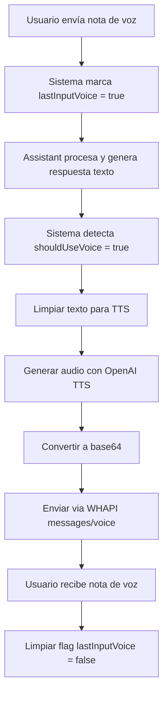

# 📝➡️🎤 Sistema Text-to-Audio (TTS - Respuestas de Voz)

## 📋 Descripción General

El sistema de **Text-to-Audio** permite al bot responder con notas de voz cuando el usuario ha enviado una nota de voz, creando una experiencia conversacional natural **voz a voz**. Utiliza la tecnología TTS (Text-to-Speech) de OpenAI para generar audio de alta calidad.

## 🔧 Componentes Técnicos

### 1. **Detección de Contexto de Voz**
```typescript
// En sendWhatsAppMessage función (línea ~975)
const userState = globalUserStates.get(chatId);
const shouldUseVoice = process.env.ENABLE_VOICE_RESPONSES === 'true' && 
    userState?.lastInputVoice === true;

if (shouldUseVoice) {
    // Generar respuesta de voz
}
```

### 2. **Generación de Audio TTS**
```typescript
// Generar audio con OpenAI TTS
const ttsResponse = await openaiClient.audio.speech.create({
    model: 'tts-1',
    voice: process.env.TTS_VOICE || 'alloy',
    input: cleanMessage,
    response_format: 'mp3',
    speed: 1.0
});

const audioBuffer = Buffer.from(await ttsResponse.arrayBuffer());
```

### 3. **Envío via Base64**
```typescript
// Convertir a base64 y enviar directamente
const base64Audio = audioBuffer.toString('base64');
const audioDataUrl = `data:audio/mp3;base64,${base64Audio}`;

const voicePayload = {
    to: chatId,
    media: audioDataUrl  // Base64 directo, sin archivos temporales
};
```

## 🎯 Flujo Completo



## ⚙️ Configuración

### Variables de Entorno
```bash
# Habilitar respuestas de voz
ENABLE_VOICE_RESPONSES=true

# Voz TTS (voces disponibles)
TTS_VOICE=nova                    # Recomendada: natural y clara
# Opciones: alloy, echo, fable, onyx, nova, shimmer

# Umbral de activación (caracteres)
VOICE_THRESHOLD=150               # Solo respuestas largas

# Probabilidad aleatoria (0.0 - 1.0)
VOICE_RANDOM_PROBABILITY=0.1      # 10% probabilidad en textos largos
```

### Voces Disponibles

| Voz | Características | Uso Recomendado |
|-----|----------------|------------------|
| **nova** | Femenina, natural, clara | ✅ **Recomendada** - Servicio al cliente |
| **alloy** | Neutral, versátil | Conversaciones generales |
| **echo** | Masculina, profesional | Anuncios formales |
| **fable** | Femenina, expresiva | Contenido emocional |
| **onyx** | Masculina, profunda | Narraciones |
| **shimmer** | Femenina, suave | Interacciones delicadas |

## 🔍 Características Especiales

### 1. **Limpieza de Texto**
```typescript
// Limpiar emojis y caracteres especiales para TTS
const cleanMessage = message
    .replace(/[\u{1F600}-\u{1F6FF}]/gu, '') // Emojis
    .replace(/\*/g, '')                      // Asteriscos
    .substring(0, 4096);                     // Límite TTS
```

### 2. **Activación Inteligente**
- **Contexto**: Solo cuando usuario envió voz previamente
- **Automático**: Sin configuración manual
- **Una vez**: Se limpia después de responder

### 3. **Optimización Base64**
```typescript
// ✅ Método actual: Base64 directo
const audioDataUrl = `data:audio/mp3;base64,${base64Audio}`;

// ❌ Método anterior: Archivos temporales + URLs
// - Sin archivos temporales
// - Sin servidor de archivos
// - Sin limpieza manual
// - Envío inmediato
```

## 📊 Logs y Monitoreo

### Eventos Registrados
```typescript
// Generación de audio
logInfo('VOICE_GENERATED', 'Audio TTS generado con base64', {
    userId: shortUserId,
    fileSize: audioBuffer.length,
    format: 'mp3'
});

// Envío exitoso
logSuccess('VOICE_RESPONSE_SENT', 'Nota de voz enviada exitosamente', {
    userId: shortUserId,
    messageLength: message.length,
    voice: process.env.TTS_VOICE || 'alloy'
});

// Limpieza de estado
logDebug('VOICE_STATE_CLEARED', 'Flag de voz limpiado', {
    userId: shortUserId
});
```

## 🧪 Testing

### Tests Disponibles
1. **`test-simple-audio.js`**: Test directo de múltiples formatos
2. **`test-text-to-audio.js`**: Flujo completo texto → audio
3. **`test-voice-response-ready.js`**: Verificación de configuración

### Ejecutar Tests
```bash
# Test de múltiples formatos TTS
node tests/audio/test-simple-audio.js

# Test completo texto a audio
node tests/audio/test-text-to-audio.js

# Verificar configuración
node tests/audio/test-voice-response-ready.js
```

### Resultados de Testing
Los tests confirman que **todos los formatos funcionan**:
- ✅ **MP3**: 86.7 KB - Universal, compatible
- ✅ **OPUS**: 17.7 KB - Mejor compresión 
- ✅ **AAC**: 21.6 KB - Optimizado móvil
- ✅ **FLAC**: 87.7 KB - Alta calidad

**Formato elegido**: MP3 por compatibilidad universal.

## 🚨 Troubleshooting

### Problemas Comunes

#### 1. "No se genera audio"
```bash
# Verificar configuración
ENABLE_VOICE_RESPONSES=true        # ¿Está habilitado?
userState.lastInputVoice = true    # ¿Usuario envió voz?

# Debug
node tests/audio/test-voice-response-ready.js
```

#### 2. "Audio no se reproduce"
```bash
# Causa común: Formato incompatible
# Solución implementada: Base64 directo con MP3

# Verificar con test
node tests/audio/test-simple-audio.js
```

#### 3. "TTS timeout"
```bash
# Aumentar timeout
OPENAI_TIMEOUT=60000

# Verificar longitud del texto
# Límite actual: 4096 caracteres
```

## 📈 Métricas de Rendimiento

### Tiempos de Generación
- **Texto 50 chars**: ~1-2 segundos
- **Texto 200 chars**: ~2-3 segundos  
- **Texto 500 chars**: ~3-5 segundos

### Tamaños de Archivo
- **MP3**: ~1-2 KB por segundo de audio
- **Texto promedio (100 chars)**: ~85 KB audio
- **Base64 overhead**: +33% del tamaño binario

### Recursos
- **CPU**: Mínimo (procesamiento en OpenAI)
- **Memoria**: ~100-500 KB por respuesta
- **Red**: Tamaño base64 + overhead HTTP

## 🔄 Integración con Sistema Completo

### Flujo Voz → Voz
```typescript
// 1. Usuario envía voz
userState.lastInputVoice = true;

// 2. Transcribir (Audio-to-Text)
const transcription = await transcribeAudio(audioUrl);

// 3. Procesamiento Assistant
const response = await processWithOpenAI(transcription);

// 4. Responder con voz (Text-to-Audio)
if (userState.lastInputVoice) {
    await generateVoiceResponse(response);
}

// 5. Limpiar estado
userState.lastInputVoice = false;
```

### Estados del Usuario
```typescript
interface UserState {
    lastInputVoice: boolean;  // ¿Último mensaje fue voz?
    // ... otros estados
}

// Almacenamiento global
const globalUserStates = new Map<string, UserState>();
```

## 🎯 Mejores Prácticas

### Para Desarrollo
1. **Siempre usar base64** para máxima compatibilidad
2. **Limpiar texto** antes de enviar a TTS
3. **Manejar errores** gracefully con fallback a texto
4. **Logs técnicos** para debugging

### Para Producción
1. **Monitoreo de uso** TTS (tiene costos)
2. **Límites de longitud** para evitar audios largos
3. **Fallback automático** si TTS falla
4. **Configuración por usuario** (opcional)

---

**🔊 Nota**: El sistema actual está optimizado para la mejor experiencia de usuario, usando base64 directo que elimina problemas de archivos temporales y garantiza reproducción inmediata en WhatsApp.